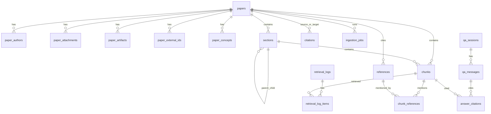

# ScholarEase MySQL 库表设计

本文档根据《项目整体架构与技术选型.md》整理 ScholarEase 的 MySQL 8 数据模型。MySQL 负责保存论文元数据、Zotero 映射、MinerU 结构化解析结果、section-aware chunk 元信息、外部学术 API 补全结果、任务状态、检索日志和问答引用追溯信息。

Qdrant、Elasticsearch、Redis 分别承担向量索引、BM25 文本索引和短期对话状态，MySQL 不保存 embedding 向量本体，只保存可追溯的业务元数据和索引状态。

## 1. 设计目标

- 支持从 Zotero 同步论文条目、PDF 附件和标签。
- 支持用户本地上传 PDF，写入 MinIO 后再同步到 Zotero。
- 支持 MinIO 保存原始 PDF 和 MinerU `full.md`、`content_list_v2.json` 解析产物。
- 支持 MinerU API 解析后的章节、段落、表格、参考文献、页码等结构化结果落库。
- 支持 Crossref / OpenAlex 补全 DOI、期刊、出版社、卷期页、引用数、开放获取链接、学科概念和引用关系。
- 支持 section-aware chunk，并为每个 chunk 保留 paper、section、page、paragraph、neighbor chunk 等引用来源信息。
- 支持 ingestion job 的断点续跑、失败重试、状态展示和任务审计。
- 支持 Qdrant、Elasticsearch、rerank 各阶段检索日志，用于 RAG 调试和评估。
- 支持问答会话、消息、答案引用来源的长期记录；短期多轮上下文仍放 Redis。

## 2. 设计约定

### 2.1 数据库约定

```sql
CREATE DATABASE IF NOT EXISTS scholarease
  DEFAULT CHARACTER SET utf8mb4
  DEFAULT COLLATE utf8mb4_0900_ai_ci;
```

- 存储引擎：`InnoDB`。
- 字符集：`utf8mb4`。
- 主键：默认使用 `BIGINT UNSIGNED AUTO_INCREMENT`，便于 Java / MyBatis Plus 使用。
- 时间字段：统一使用 `DATETIME(3)`，保留毫秒。
- 状态字段：使用 `VARCHAR(32)`，避免 MySQL `ENUM` 后续扩展不便。
- JSON 字段：用于外部 API 原始响应、MinerU 原始结构、作者列表、标签、概念等半结构化数据。
- 软删除：MVP 暂不强制全表软删除；业务删除优先通过状态字段表达。
- 文件存储：ScholarEase 内部以 MinIO 保存原始 PDF 和 MinerU 产物，Zotero 作为双向同步的文献管理端；MySQL 只记录 Zotero 映射、MinIO 对象地址、hash、大小、同步状态和解析状态。

### 2.2 通用字段

核心业务表建议统一包含：

| 字段 | 类型 | 说明 |
|---|---|---|
| `created_at` | `DATETIME(3)` | 创建时间 |
| `updated_at` | `DATETIME(3)` | 更新时间 |

任务和日志表额外包含：

| 字段 | 类型 | 说明 |
|---|---|---|
| `started_at` | `DATETIME(3)` | 开始时间 |
| `finished_at` | `DATETIME(3)` | 结束时间 |
| `error_message` | `TEXT` | 失败原因 |

### 2.3 状态值建议

`papers.parse_status`：

```text
PENDING
PARSING
PARSED
FAILED
SKIPPED
```

`papers.metadata_status`：

```text
PENDING
RESOLVING
RESOLVED
PARTIAL
FAILED
```

`papers.index_status`：

```text
PENDING
EMBEDDING
INDEXING
INDEXED
PARTIAL
FAILED
```

`ingestion_jobs.status`：

```text
PENDING
RUNNING
SUCCESS
FAILED
CANCELED
RETRYING
```

`paper_attachments.sync_status`：

```text
PENDING
SYNCED
SYNCING
SYNC_CONFLICT
FAILED
```

`paper_artifacts.artifact_type`：

```text
ORIGINAL_PDF
MINERU_FULL_MD
MINERU_CONTENT_LIST_V2_JSON
```

## 3. 核心 ER 关系



## 4. 表清单

| 表名 | 职责 |
|---|---|
| `papers` | 论文主表，保存 Zotero 映射、核心元数据和处理状态 |
| `paper_authors` | 论文作者列表，支持作者检索和展示顺序 |
| `paper_attachments` | PDF 附件记录，保存 Zotero attachment 与 MinIO 原始 PDF 对象的映射 |
| `paper_artifacts` | 文件产物记录，保存原始 PDF、MinerU `full.md`、MinerU `content_list_v2.json` 等 MinIO 对象 |
| `paper_external_ids` | DOI、OpenAlex、Crossref、arXiv 等外部标识映射 |
| `paper_concepts` | OpenAlex concepts / 学科标签 |
| `sections` | MinerU 解析得到的章节树 |
| `chunks` | section-aware chunk 文本与 provenance 信息 |
| `references` | MinerU 抽取的参考文献条目 |
| `chunk_references` | 正文 chunk 中出现的参考文献 mention |
| `citations` | OpenAlex 补全后的论文引用关系 |
| `ingestion_jobs` | Zotero 同步、解析、补全、embedding、索引任务 |
| `ingestion_job_steps` | 任务子步骤状态，便于断点续跑和前端进度展示 |
| `retrieval_logs` | 一次检索请求的整体日志 |
| `retrieval_log_items` | dense、BM25、merge、rerank 各阶段召回明细 |
| `qa_sessions` | 问答会话摘要 |
| `qa_messages` | 问答消息记录 |
| `answer_citations` | 答案引用来源，关联 paper / section / chunk |
| `evaluation_sets` | 检索与问答评估集 |
| `evaluation_questions` | 评估问题和期望证据 |
| `evaluation_runs` | 某次评估运行记录 |

## 5. 建表 DDL

### 5.1 论文主表

```sql
CREATE TABLE papers (
  paper_id BIGINT UNSIGNED NOT NULL AUTO_INCREMENT COMMENT '论文ID',
  zotero_library_id VARCHAR(64) NULL COMMENT 'Zotero library id',
  zotero_item_key VARCHAR(64) NULL COMMENT 'Zotero item key',
  zotero_version BIGINT UNSIGNED NULL COMMENT 'Zotero item version',

  title VARCHAR(1024) NOT NULL COMMENT '论文标题',
  title_normalized VARCHAR(1024) NULL COMMENT '归一化标题，用于去重',
  abstract MEDIUMTEXT NULL COMMENT '摘要',
  authors_json JSON NULL COMMENT '作者列表快照',
  year SMALLINT UNSIGNED NULL COMMENT '发表年份',
  publication_date DATE NULL COMMENT '发表日期',
  venue VARCHAR(512) NULL COMMENT '期刊/会议/出版源',
  venue_type VARCHAR(64) NULL COMMENT 'journal/conference/preprint/book 等',
  publisher VARCHAR(512) NULL COMMENT '出版社',
  volume VARCHAR(64) NULL COMMENT '卷',
  issue VARCHAR(64) NULL COMMENT '期',
  pages VARCHAR(128) NULL COMMENT '页码范围',
  language VARCHAR(32) NOT NULL DEFAULT 'en' COMMENT '论文语言',

  doi VARCHAR(255) NULL COMMENT 'DOI',
  issn VARCHAR(64) NULL COMMENT 'ISSN',
  isbn VARCHAR(64) NULL COMMENT 'ISBN',
  arxiv_id VARCHAR(128) NULL COMMENT 'arXiv id',
  crossref_id VARCHAR(255) NULL COMMENT 'Crossref id',
  openalex_id VARCHAR(255) NULL COMMENT 'OpenAlex work id',
  cited_by_count INT UNSIGNED NOT NULL DEFAULT 0 COMMENT '引用数',
  open_access_url VARCHAR(1024) NULL COMMENT '开放获取链接',
  landing_page_url VARCHAR(1024) NULL COMMENT '论文落地页',

  tags_json JSON NULL COMMENT 'Zotero 标签快照',
  keywords_json JSON NULL COMMENT '关键词',
  source_priority VARCHAR(32) NOT NULL DEFAULT 'ZOTERO' COMMENT '主元数据来源',

  pdf_attachment_key VARCHAR(64) NULL COMMENT '当前主 PDF attachment key',
  pdf_storage_bucket VARCHAR(128) NULL COMMENT '当前主 PDF MinIO bucket 快照',
  pdf_storage_object_key VARCHAR(1024) NULL COMMENT '当前主 PDF MinIO object key 快照',
  pdf_content_hash CHAR(64) NULL COMMENT 'PDF sha256',

  parse_status VARCHAR(32) NOT NULL DEFAULT 'PENDING' COMMENT '解析状态',
  metadata_status VARCHAR(32) NOT NULL DEFAULT 'PENDING' COMMENT '元数据补全状态',
  index_status VARCHAR(32) NOT NULL DEFAULT 'PENDING' COMMENT '索引状态',
  last_parsed_at DATETIME(3) NULL COMMENT '最近解析时间',
  last_metadata_resolved_at DATETIME(3) NULL COMMENT '最近元数据补全时间',
  last_indexed_at DATETIME(3) NULL COMMENT '最近索引时间',

  created_at DATETIME(3) NOT NULL DEFAULT CURRENT_TIMESTAMP(3),
  updated_at DATETIME(3) NOT NULL DEFAULT CURRENT_TIMESTAMP(3) ON UPDATE CURRENT_TIMESTAMP(3),

  PRIMARY KEY (paper_id),
  UNIQUE KEY uk_papers_zotero (zotero_library_id, zotero_item_key),
  UNIQUE KEY uk_papers_doi (doi),
  UNIQUE KEY uk_papers_openalex (openalex_id),
  KEY idx_papers_year (year),
  KEY idx_papers_status (parse_status, metadata_status, index_status),
  KEY idx_papers_pdf_hash (pdf_content_hash),
  FULLTEXT KEY ft_papers_title_abstract (title, abstract)
) ENGINE=InnoDB DEFAULT CHARSET=utf8mb4 COLLATE=utf8mb4_0900_ai_ci COMMENT='论文主表';
```

### 5.2 作者表

```sql
CREATE TABLE paper_authors (
  author_id BIGINT UNSIGNED NOT NULL AUTO_INCREMENT COMMENT '作者记录ID',
  paper_id BIGINT UNSIGNED NOT NULL COMMENT '论文ID',
  author_order INT UNSIGNED NOT NULL COMMENT '作者顺序，从1开始',
  full_name VARCHAR(512) NOT NULL COMMENT '作者全名',
  given_name VARCHAR(255) NULL COMMENT '名',
  family_name VARCHAR(255) NULL COMMENT '姓',
  affiliation VARCHAR(1024) NULL COMMENT '机构',
  orcid VARCHAR(64) NULL COMMENT 'ORCID',
  openalex_author_id VARCHAR(255) NULL COMMENT 'OpenAlex author id',
  is_corresponding TINYINT(1) NOT NULL DEFAULT 0 COMMENT '是否通讯作者',
  created_at DATETIME(3) NOT NULL DEFAULT CURRENT_TIMESTAMP(3),
  updated_at DATETIME(3) NOT NULL DEFAULT CURRENT_TIMESTAMP(3) ON UPDATE CURRENT_TIMESTAMP(3),

  PRIMARY KEY (author_id),
  UNIQUE KEY uk_paper_author_order (paper_id, author_order),
  KEY idx_author_name (full_name),
  KEY idx_author_orcid (orcid),
  CONSTRAINT fk_paper_authors_paper
    FOREIGN KEY (paper_id) REFERENCES papers (paper_id)
    ON DELETE CASCADE
) ENGINE=InnoDB DEFAULT CHARSET=utf8mb4 COLLATE=utf8mb4_0900_ai_ci COMMENT='论文作者表';
```

### 5.3 PDF 附件表

```sql
CREATE TABLE paper_attachments (
  attachment_id BIGINT UNSIGNED NOT NULL AUTO_INCREMENT COMMENT '附件ID',
  paper_id BIGINT UNSIGNED NOT NULL COMMENT '论文ID',
  zotero_attachment_key VARCHAR(64) NULL COMMENT 'Zotero attachment key',
  zotero_version BIGINT UNSIGNED NULL COMMENT 'Zotero attachment version',
  attachment_type VARCHAR(64) NOT NULL DEFAULT 'PDF' COMMENT '附件类型',
  file_name VARCHAR(512) NULL COMMENT '文件名',
  local_path VARCHAR(1024) NULL COMMENT '导入时的本地路径快照，仅用于排查',
  remote_url VARCHAR(1024) NULL COMMENT 'Zotero 或开放获取远程下载链接',

  storage_bucket VARCHAR(128) NOT NULL COMMENT 'MinIO bucket',
  storage_object_key VARCHAR(1024) NOT NULL COMMENT 'MinIO object key',
  storage_etag VARCHAR(255) NULL COMMENT 'MinIO etag',
  storage_version_id VARCHAR(255) NULL COMMENT 'MinIO version id，可选',
  content_hash CHAR(64) NOT NULL COMMENT 'PDF sha256',
  file_size_bytes BIGINT UNSIGNED NULL COMMENT '文件大小',
  mime_type VARCHAR(128) NOT NULL DEFAULT 'application/pdf' COMMENT 'MIME 类型',
  page_count INT UNSIGNED NULL COMMENT '页数',
  is_primary TINYINT(1) NOT NULL DEFAULT 1 COMMENT '是否主 PDF',

  import_source VARCHAR(64) NOT NULL DEFAULT 'ZOTERO_SYNC' COMMENT 'ZOTERO_SYNC/LOCAL_UPLOAD/MANUAL_IMPORT',
  sync_status VARCHAR(32) NOT NULL DEFAULT 'PENDING' COMMENT 'PENDING/SYNCED/SYNCING/SYNC_CONFLICT/FAILED',
  last_synced_at DATETIME(3) NULL COMMENT '最近 Zotero 与 MinIO 同步完成时间',
  sync_error_message TEXT NULL COMMENT '同步失败原因',

  mineru_version VARCHAR(128) NULL COMMENT 'MinerU 版本或 API 版本',
  parse_status VARCHAR(32) NOT NULL DEFAULT 'PENDING' COMMENT '附件解析状态',
  parsed_at DATETIME(3) NULL COMMENT '解析完成时间',

  created_at DATETIME(3) NOT NULL DEFAULT CURRENT_TIMESTAMP(3),
  updated_at DATETIME(3) NOT NULL DEFAULT CURRENT_TIMESTAMP(3) ON UPDATE CURRENT_TIMESTAMP(3),

  PRIMARY KEY (attachment_id),
  UNIQUE KEY uk_attachment_zotero (zotero_attachment_key),
  UNIQUE KEY uk_attachment_object (storage_bucket, storage_object_key),
  KEY idx_attachment_paper (paper_id),
  KEY idx_attachment_hash (content_hash),
  KEY idx_attachment_sync_status (sync_status),
  CONSTRAINT fk_attachments_paper
    FOREIGN KEY (paper_id) REFERENCES papers (paper_id)
    ON DELETE CASCADE
) ENGINE=InnoDB DEFAULT CHARSET=utf8mb4 COLLATE=utf8mb4_0900_ai_ci COMMENT='论文附件表';
```

说明：

- `paper_attachments` 只描述 PDF 附件本体和同步状态。
- MinerU 输出文件不放在 `paper_attachments` 中，统一放入 `paper_artifacts`。
- `content_hash` 是判断是否需要重新解析、重新索引、同步到 Zotero 的核心依据。

### 5.4 文件产物表

```sql
CREATE TABLE paper_artifacts (
  artifact_id BIGINT UNSIGNED NOT NULL AUTO_INCREMENT COMMENT '文件产物ID',
  paper_id BIGINT UNSIGNED NOT NULL COMMENT '论文ID',
  attachment_id BIGINT UNSIGNED NULL COMMENT '来源附件ID',
  artifact_type VARCHAR(64) NOT NULL COMMENT 'ORIGINAL_PDF/MINERU_FULL_MD/MINERU_CONTENT_LIST_V2_JSON',
  file_name VARCHAR(512) NULL COMMENT '文件名',
  storage_bucket VARCHAR(128) NOT NULL COMMENT 'MinIO bucket',
  storage_object_key VARCHAR(1024) NOT NULL COMMENT 'MinIO object key',
  storage_etag VARCHAR(255) NULL COMMENT 'MinIO etag',
  storage_version_id VARCHAR(255) NULL COMMENT 'MinIO version id，可选',
  content_hash CHAR(64) NULL COMMENT 'sha256',
  file_size_bytes BIGINT UNSIGNED NULL COMMENT '文件大小',
  mime_type VARCHAR(128) NULL COMMENT 'MIME 类型',
  source VARCHAR(64) NOT NULL DEFAULT 'SYSTEM' COMMENT 'LOCAL_UPLOAD/ZOTERO_SYNC/MINERU/SYSTEM',
  producer_version VARCHAR(128) NULL COMMENT '生成工具版本，如 MinerU API 版本',
  metadata_json JSON NULL COMMENT '页数、解析任务、模型参数等补充信息',
  created_at DATETIME(3) NOT NULL DEFAULT CURRENT_TIMESTAMP(3),
  updated_at DATETIME(3) NOT NULL DEFAULT CURRENT_TIMESTAMP(3) ON UPDATE CURRENT_TIMESTAMP(3),

  PRIMARY KEY (artifact_id),
  UNIQUE KEY uk_artifact_object (storage_bucket, storage_object_key),
  UNIQUE KEY uk_artifact_paper_type_hash (paper_id, artifact_type, content_hash),
  KEY idx_artifact_paper_type (paper_id, artifact_type),
  KEY idx_artifact_attachment (attachment_id),
  CONSTRAINT fk_artifacts_paper
    FOREIGN KEY (paper_id) REFERENCES papers (paper_id)
    ON DELETE CASCADE,
  CONSTRAINT fk_artifacts_attachment
    FOREIGN KEY (attachment_id) REFERENCES paper_attachments (attachment_id)
    ON DELETE SET NULL
) ENGINE=InnoDB DEFAULT CHARSET=utf8mb4 COLLATE=utf8mb4_0900_ai_ci COMMENT='论文文件产物表';
```

### 5.5 外部标识表

```sql
CREATE TABLE paper_external_ids (
  external_id BIGINT UNSIGNED NOT NULL AUTO_INCREMENT COMMENT '外部标识记录ID',
  paper_id BIGINT UNSIGNED NOT NULL COMMENT '论文ID',
  source VARCHAR(64) NOT NULL COMMENT 'DOI/CROSSREF/OPENALEX/ARXIV/SEMANTIC_SCHOLAR 等',
  external_key VARCHAR(512) NOT NULL COMMENT '外部标识值',
  external_url VARCHAR(1024) NULL COMMENT '外部链接',
  match_method VARCHAR(64) NULL COMMENT 'DOI_EXACT/TITLE_AUTHOR_YEAR 等',
  confidence DECIMAL(6,5) NULL COMMENT '匹配置信度',
  raw_payload JSON NULL COMMENT '外部 API 原始片段',
  created_at DATETIME(3) NOT NULL DEFAULT CURRENT_TIMESTAMP(3),
  updated_at DATETIME(3) NOT NULL DEFAULT CURRENT_TIMESTAMP(3) ON UPDATE CURRENT_TIMESTAMP(3),

  PRIMARY KEY (external_id),
  UNIQUE KEY uk_paper_external_source_key (paper_id, source, external_key),
  KEY idx_external_source_key (source, external_key),
  CONSTRAINT fk_external_ids_paper
    FOREIGN KEY (paper_id) REFERENCES papers (paper_id)
    ON DELETE CASCADE
) ENGINE=InnoDB DEFAULT CHARSET=utf8mb4 COLLATE=utf8mb4_0900_ai_ci COMMENT='论文外部标识表';
```

### 5.6 学科概念表

```sql
CREATE TABLE paper_concepts (
  concept_id BIGINT UNSIGNED NOT NULL AUTO_INCREMENT COMMENT '概念记录ID',
  paper_id BIGINT UNSIGNED NOT NULL COMMENT '论文ID',
  source VARCHAR(64) NOT NULL DEFAULT 'OPENALEX' COMMENT '来源',
  external_concept_id VARCHAR(255) NULL COMMENT '外部概念ID',
  display_name VARCHAR(512) NOT NULL COMMENT '概念名称',
  level INT NULL COMMENT 'OpenAlex concept level',
  score DECIMAL(8,6) NULL COMMENT '相关性分数',
  created_at DATETIME(3) NOT NULL DEFAULT CURRENT_TIMESTAMP(3),
  updated_at DATETIME(3) NOT NULL DEFAULT CURRENT_TIMESTAMP(3) ON UPDATE CURRENT_TIMESTAMP(3),

  PRIMARY KEY (concept_id),
  UNIQUE KEY uk_paper_concept (paper_id, source, display_name),
  KEY idx_concept_name (display_name),
  CONSTRAINT fk_concepts_paper
    FOREIGN KEY (paper_id) REFERENCES papers (paper_id)
    ON DELETE CASCADE
) ENGINE=InnoDB DEFAULT CHARSET=utf8mb4 COLLATE=utf8mb4_0900_ai_ci COMMENT='论文学科概念表';
```

### 5.7 章节表

```sql
CREATE TABLE sections (
  section_id BIGINT UNSIGNED NOT NULL AUTO_INCREMENT COMMENT '章节ID',
  paper_id BIGINT UNSIGNED NOT NULL COMMENT '论文ID',
  parent_section_id BIGINT UNSIGNED NULL COMMENT '父章节ID',
  section_order INT UNSIGNED NOT NULL COMMENT '同级章节顺序',
  section_level INT UNSIGNED NOT NULL DEFAULT 1 COMMENT '章节层级',
  section_number VARCHAR(64) NULL COMMENT '章节编号，如 3.2.1',
  section_title VARCHAR(1024) NOT NULL COMMENT '章节标题',
  section_type VARCHAR(64) NOT NULL DEFAULT 'BODY' COMMENT 'ABSTRACT/INTRODUCTION/METHOD/RESULT/DISCUSSION/LIMITATION/REFERENCE 等',
  section_path VARCHAR(2048) NOT NULL COMMENT '章节路径',
  page_start INT UNSIGNED NULL COMMENT '起始页',
  page_end INT UNSIGNED NULL COMMENT '结束页',
  paragraph_count INT UNSIGNED NOT NULL DEFAULT 0 COMMENT '段落数',
  token_count INT UNSIGNED NULL COMMENT '章节 token 数',
  raw_payload JSON NULL COMMENT 'MinerU 章节原始结构',
  created_at DATETIME(3) NOT NULL DEFAULT CURRENT_TIMESTAMP(3),
  updated_at DATETIME(3) NOT NULL DEFAULT CURRENT_TIMESTAMP(3) ON UPDATE CURRENT_TIMESTAMP(3),

  PRIMARY KEY (section_id),
  KEY idx_sections_paper_order (paper_id, section_order),
  KEY idx_sections_paper_type (paper_id, section_type),
  KEY idx_sections_parent (parent_section_id),
  CONSTRAINT fk_sections_paper
    FOREIGN KEY (paper_id) REFERENCES papers (paper_id)
    ON DELETE CASCADE,
  CONSTRAINT fk_sections_parent
    FOREIGN KEY (parent_section_id) REFERENCES sections (section_id)
    ON DELETE SET NULL
) ENGINE=InnoDB DEFAULT CHARSET=utf8mb4 COLLATE=utf8mb4_0900_ai_ci COMMENT='论文章节表';
```

### 5.8 Chunk 表

```sql
CREATE TABLE chunks (
  chunk_id BIGINT UNSIGNED NOT NULL AUTO_INCREMENT COMMENT 'chunk ID',
  paper_id BIGINT UNSIGNED NOT NULL COMMENT '论文ID',
  section_id BIGINT UNSIGNED NULL COMMENT '所属章节ID',
  parent_section_id BIGINT UNSIGNED NULL COMMENT '用于上下文扩展的父章节ID',
  previous_chunk_id BIGINT UNSIGNED NULL COMMENT '上一篇 chunk',
  next_chunk_id BIGINT UNSIGNED NULL COMMENT '下一篇 chunk',

  chunk_order INT UNSIGNED NOT NULL COMMENT '论文内 chunk 顺序',
  chunk_type VARCHAR(64) NOT NULL DEFAULT 'TEXT' COMMENT 'TEXT/ABSTRACT/TABLE/FIGURE_CAPTION/FORMULA/SUMMARY 等',
  section_title VARCHAR(1024) NULL COMMENT '章节标题快照',
  section_path VARCHAR(2048) NULL COMMENT '章节路径快照',
  section_type VARCHAR(64) NULL COMMENT '章节类型快照',
  paragraph_index INT UNSIGNED NULL COMMENT '章节内段落序号',
  page_start INT UNSIGNED NULL COMMENT '起始页',
  page_end INT UNSIGNED NULL COMMENT '结束页',

  chunk_text MEDIUMTEXT NOT NULL COMMENT '原始 chunk 文本',
  context_text MEDIUMTEXT NULL COMMENT '带 title/year/venue/section/page 前缀的索引文本',
  token_count INT UNSIGNED NULL COMMENT 'token 数',
  char_count INT UNSIGNED NULL COMMENT '字符数',
  content_hash CHAR(64) NOT NULL COMMENT 'chunk 内容 sha256',

  embedding_model VARCHAR(128) NULL COMMENT 'embedding 模型',
  embedding_dimension INT UNSIGNED NULL COMMENT '向量维度',
  qdrant_collection VARCHAR(128) NULL COMMENT 'Qdrant collection',
  qdrant_point_id VARCHAR(128) NULL COMMENT 'Qdrant point id',
  elasticsearch_index VARCHAR(128) NULL COMMENT 'Elasticsearch index',
  elasticsearch_doc_id VARCHAR(128) NULL COMMENT 'Elasticsearch doc id',
  indexed_at DATETIME(3) NULL COMMENT '索引完成时间',
  index_status VARCHAR(32) NOT NULL DEFAULT 'PENDING' COMMENT '索引状态',

  raw_payload JSON NULL COMMENT 'MinerU chunk 原始结构',
  created_at DATETIME(3) NOT NULL DEFAULT CURRENT_TIMESTAMP(3),
  updated_at DATETIME(3) NOT NULL DEFAULT CURRENT_TIMESTAMP(3) ON UPDATE CURRENT_TIMESTAMP(3),

  PRIMARY KEY (chunk_id),
  UNIQUE KEY uk_chunks_paper_order (paper_id, chunk_order),
  UNIQUE KEY uk_chunks_content_hash (paper_id, content_hash),
  KEY idx_chunks_paper_section (paper_id, section_id),
  KEY idx_chunks_section_type (section_type),
  KEY idx_chunks_page (paper_id, page_start, page_end),
  KEY idx_chunks_index_status (index_status),
  FULLTEXT KEY ft_chunks_text (chunk_text),
  CONSTRAINT fk_chunks_paper
    FOREIGN KEY (paper_id) REFERENCES papers (paper_id)
    ON DELETE CASCADE,
  CONSTRAINT fk_chunks_section
    FOREIGN KEY (section_id) REFERENCES sections (section_id)
    ON DELETE SET NULL,
  CONSTRAINT fk_chunks_parent_section
    FOREIGN KEY (parent_section_id) REFERENCES sections (section_id)
    ON DELETE SET NULL
) ENGINE=InnoDB DEFAULT CHARSET=utf8mb4 COLLATE=utf8mb4_0900_ai_ci COMMENT='论文分块表';
```

说明：

- `chunk_text` 是正文片段，面向展示和引用。
- `context_text` 是用于索引的增强文本，可包含论文标题、年份、venue、DOI、section path、page 等上下文前缀。
- `qdrant_point_id` 和 `elasticsearch_doc_id` 用于跨系统排查索引一致性。

### 5.9 参考文献表

```sql
CREATE TABLE `references` (
  reference_id BIGINT UNSIGNED NOT NULL AUTO_INCREMENT COMMENT '参考文献ID',
  paper_id BIGINT UNSIGNED NOT NULL COMMENT '引用方论文ID',
  reference_order INT UNSIGNED NOT NULL COMMENT '参考文献顺序',
  raw_text TEXT NOT NULL COMMENT 'MinerU 抽取的参考文献原文',
  title VARCHAR(1024) NULL COMMENT '匹配后的标题',
  authors_json JSON NULL COMMENT '匹配后的作者',
  year SMALLINT UNSIGNED NULL COMMENT '年份',
  venue VARCHAR(512) NULL COMMENT '期刊/会议',
  doi VARCHAR(255) NULL COMMENT 'DOI',
  arxiv_id VARCHAR(128) NULL COMMENT 'arXiv id',
  openalex_id VARCHAR(255) NULL COMMENT 'OpenAlex id',
  matched_paper_id BIGINT UNSIGNED NULL COMMENT '若本库已有该论文，关联 paper_id',
  match_status VARCHAR(32) NOT NULL DEFAULT 'PENDING' COMMENT 'PENDING/MATCHED/AMBIGUOUS/FAILED',
  match_confidence DECIMAL(6,5) NULL COMMENT '匹配置信度',
  raw_payload JSON NULL COMMENT '匹配 API 原始结果',
  created_at DATETIME(3) NOT NULL DEFAULT CURRENT_TIMESTAMP(3),
  updated_at DATETIME(3) NOT NULL DEFAULT CURRENT_TIMESTAMP(3) ON UPDATE CURRENT_TIMESTAMP(3),

  PRIMARY KEY (reference_id),
  UNIQUE KEY uk_reference_paper_order (paper_id, reference_order),
  KEY idx_reference_doi (doi),
  KEY idx_reference_openalex (openalex_id),
  KEY idx_reference_matched_paper (matched_paper_id),
  CONSTRAINT fk_references_paper
    FOREIGN KEY (paper_id) REFERENCES papers (paper_id)
    ON DELETE CASCADE,
  CONSTRAINT fk_references_matched_paper
    FOREIGN KEY (matched_paper_id) REFERENCES papers (paper_id)
    ON DELETE SET NULL
) ENGINE=InnoDB DEFAULT CHARSET=utf8mb4 COLLATE=utf8mb4_0900_ai_ci COMMENT='参考文献表';
```

### 5.10 Chunk 引文出现表

```sql
CREATE TABLE chunk_references (
  chunk_reference_id BIGINT UNSIGNED NOT NULL AUTO_INCREMENT COMMENT 'chunk 引文出现ID',
  chunk_id BIGINT UNSIGNED NOT NULL COMMENT 'chunk ID',
  paper_id BIGINT UNSIGNED NOT NULL COMMENT '冗余论文ID，便于查询',
  reference_id BIGINT UNSIGNED NULL COMMENT '参考文献ID',
  mention_text VARCHAR(255) NOT NULL COMMENT '正文中的引文标记，如 [12] 或 Smith et al., 2020',
  char_start INT UNSIGNED NULL COMMENT 'chunk 内起始字符位置',
  char_end INT UNSIGNED NULL COMMENT 'chunk 内结束字符位置',
  created_at DATETIME(3) NOT NULL DEFAULT CURRENT_TIMESTAMP(3),

  PRIMARY KEY (chunk_reference_id),
  KEY idx_chunk_references_chunk (chunk_id),
  KEY idx_chunk_references_reference (reference_id),
  KEY idx_chunk_references_paper (paper_id),
  CONSTRAINT fk_chunk_refs_chunk
    FOREIGN KEY (chunk_id) REFERENCES chunks (chunk_id)
    ON DELETE CASCADE,
  CONSTRAINT fk_chunk_refs_reference
    FOREIGN KEY (reference_id) REFERENCES `references` (reference_id)
    ON DELETE SET NULL,
  CONSTRAINT fk_chunk_refs_paper
    FOREIGN KEY (paper_id) REFERENCES papers (paper_id)
    ON DELETE CASCADE
) ENGINE=InnoDB DEFAULT CHARSET=utf8mb4 COLLATE=utf8mb4_0900_ai_ci COMMENT='chunk 内引文出现表';
```

### 5.11 引用关系表

```sql
CREATE TABLE citations (
  citation_id BIGINT UNSIGNED NOT NULL AUTO_INCREMENT COMMENT '引用关系ID',
  source_paper_id BIGINT UNSIGNED NULL COMMENT '引用方论文ID，本库内可为空',
  target_paper_id BIGINT UNSIGNED NULL COMMENT '被引用论文ID，本库内可为空',
  source_openalex_id VARCHAR(255) NULL COMMENT '引用方 OpenAlex id',
  target_openalex_id VARCHAR(255) NULL COMMENT '被引用方 OpenAlex id',
  source_doi VARCHAR(255) NULL COMMENT '引用方 DOI',
  target_doi VARCHAR(255) NULL COMMENT '被引用方 DOI',
  relation_source VARCHAR(64) NOT NULL DEFAULT 'OPENALEX' COMMENT '关系来源',
  relation_type VARCHAR(64) NOT NULL DEFAULT 'REFERENCES' COMMENT 'REFERENCES/CITED_BY',
  created_at DATETIME(3) NOT NULL DEFAULT CURRENT_TIMESTAMP(3),
  updated_at DATETIME(3) NOT NULL DEFAULT CURRENT_TIMESTAMP(3) ON UPDATE CURRENT_TIMESTAMP(3),

  PRIMARY KEY (citation_id),
  UNIQUE KEY uk_citation_openalex (source_openalex_id, target_openalex_id),
  KEY idx_citation_source_paper (source_paper_id),
  KEY idx_citation_target_paper (target_paper_id),
  KEY idx_citation_target_openalex (target_openalex_id),
  CONSTRAINT fk_citations_source_paper
    FOREIGN KEY (source_paper_id) REFERENCES papers (paper_id)
    ON DELETE SET NULL,
  CONSTRAINT fk_citations_target_paper
    FOREIGN KEY (target_paper_id) REFERENCES papers (paper_id)
    ON DELETE SET NULL
) ENGINE=InnoDB DEFAULT CHARSET=utf8mb4 COLLATE=utf8mb4_0900_ai_ci COMMENT='论文引用关系表';
```

### 5.12 Ingestion 任务表

```sql
CREATE TABLE ingestion_jobs (
  job_id BIGINT UNSIGNED NOT NULL AUTO_INCREMENT COMMENT '任务ID',
  paper_id BIGINT UNSIGNED NULL COMMENT '论文ID，可为空用于全量同步任务',
  attachment_id BIGINT UNSIGNED NULL COMMENT '附件ID',
  job_type VARCHAR(64) NOT NULL COMMENT 'ZOTERO_SYNC/PARSE_PDF/RESOLVE_METADATA/BUILD_CHUNKS/EMBED/INDEX/REINDEX',
  status VARCHAR(32) NOT NULL DEFAULT 'PENDING' COMMENT '任务状态',
  priority INT NOT NULL DEFAULT 0 COMMENT '优先级，越大越优先',
  retry_count INT UNSIGNED NOT NULL DEFAULT 0 COMMENT '已重试次数',
  max_retry_count INT UNSIGNED NOT NULL DEFAULT 3 COMMENT '最大重试次数',
  progress_percent DECIMAL(5,2) NOT NULL DEFAULT 0.00 COMMENT '进度百分比',
  trigger_source VARCHAR(64) NOT NULL DEFAULT 'SYSTEM' COMMENT 'ZOTERO_SYNC/MANUAL/SCHEDULED/API',
  request_payload JSON NULL COMMENT '任务输入',
  result_payload JSON NULL COMMENT '任务输出摘要',
  error_code VARCHAR(128) NULL COMMENT '错误码',
  error_message TEXT NULL COMMENT '错误信息',
  started_at DATETIME(3) NULL COMMENT '开始时间',
  finished_at DATETIME(3) NULL COMMENT '结束时间',
  created_at DATETIME(3) NOT NULL DEFAULT CURRENT_TIMESTAMP(3),
  updated_at DATETIME(3) NOT NULL DEFAULT CURRENT_TIMESTAMP(3) ON UPDATE CURRENT_TIMESTAMP(3),

  PRIMARY KEY (job_id),
  KEY idx_jobs_status_priority (status, priority, created_at),
  KEY idx_jobs_paper_type (paper_id, job_type),
  KEY idx_jobs_attachment (attachment_id),
  CONSTRAINT fk_jobs_paper
    FOREIGN KEY (paper_id) REFERENCES papers (paper_id)
    ON DELETE SET NULL,
  CONSTRAINT fk_jobs_attachment
    FOREIGN KEY (attachment_id) REFERENCES paper_attachments (attachment_id)
    ON DELETE SET NULL
) ENGINE=InnoDB DEFAULT CHARSET=utf8mb4 COLLATE=utf8mb4_0900_ai_ci COMMENT='导入处理任务表';
```

### 5.13 Ingestion 任务步骤表

```sql
CREATE TABLE ingestion_job_steps (
  step_id BIGINT UNSIGNED NOT NULL AUTO_INCREMENT COMMENT '任务步骤ID',
  job_id BIGINT UNSIGNED NOT NULL COMMENT '任务ID',
  step_order INT UNSIGNED NOT NULL COMMENT '步骤顺序',
  step_name VARCHAR(128) NOT NULL COMMENT '步骤名',
  status VARCHAR(32) NOT NULL DEFAULT 'PENDING' COMMENT '步骤状态',
  progress_percent DECIMAL(5,2) NOT NULL DEFAULT 0.00 COMMENT '步骤进度',
  input_payload JSON NULL COMMENT '步骤输入',
  output_payload JSON NULL COMMENT '步骤输出摘要',
  error_message TEXT NULL COMMENT '错误信息',
  started_at DATETIME(3) NULL COMMENT '开始时间',
  finished_at DATETIME(3) NULL COMMENT '结束时间',
  created_at DATETIME(3) NOT NULL DEFAULT CURRENT_TIMESTAMP(3),
  updated_at DATETIME(3) NOT NULL DEFAULT CURRENT_TIMESTAMP(3) ON UPDATE CURRENT_TIMESTAMP(3),

  PRIMARY KEY (step_id),
  UNIQUE KEY uk_job_step_order (job_id, step_order),
  KEY idx_step_status (status),
  CONSTRAINT fk_job_steps_job
    FOREIGN KEY (job_id) REFERENCES ingestion_jobs (job_id)
    ON DELETE CASCADE
) ENGINE=InnoDB DEFAULT CHARSET=utf8mb4 COLLATE=utf8mb4_0900_ai_ci COMMENT='导入处理任务步骤表';
```

### 5.14 检索日志表

```sql
CREATE TABLE retrieval_logs (
  retrieval_log_id BIGINT UNSIGNED NOT NULL AUTO_INCREMENT COMMENT '检索日志ID',
  session_id VARCHAR(128) NULL COMMENT '会话ID',
  message_id BIGINT UNSIGNED NULL COMMENT '关联问答消息ID',
  query_text TEXT NOT NULL COMMENT '用户原始问题',
  query_rewrite TEXT NULL COMMENT '改写后的查询',
  query_language VARCHAR(32) NOT NULL DEFAULT 'zh' COMMENT '查询语言',
  route_type VARCHAR(64) NULL COMMENT 'SUMMARY/METHOD/EXPERIMENT/CONCEPT/COMPARE/EVIDENCE 等',
  dense_top_k INT UNSIGNED NOT NULL DEFAULT 40 COMMENT 'Qdrant topK',
  bm25_top_k INT UNSIGNED NOT NULL DEFAULT 40 COMMENT 'BM25 topK',
  merged_top_k INT UNSIGNED NOT NULL DEFAULT 60 COMMENT '融合 topK',
  rerank_top_k INT UNSIGNED NOT NULL DEFAULT 10 COMMENT '精排 topK',
  final_context_count INT UNSIGNED NULL COMMENT '最终上下文数量',
  filters_json JSON NULL COMMENT 'metadata filter',
  latency_ms INT UNSIGNED NULL COMMENT '总耗时毫秒',
  status VARCHAR(32) NOT NULL DEFAULT 'SUCCESS' COMMENT 'SUCCESS/FAILED',
  error_message TEXT NULL COMMENT '错误信息',
  created_at DATETIME(3) NOT NULL DEFAULT CURRENT_TIMESTAMP(3),

  PRIMARY KEY (retrieval_log_id),
  KEY idx_retrieval_session (session_id, created_at),
  KEY idx_retrieval_message (message_id),
  KEY idx_retrieval_route (route_type),
  KEY idx_retrieval_created_at (created_at)
) ENGINE=InnoDB DEFAULT CHARSET=utf8mb4 COLLATE=utf8mb4_0900_ai_ci COMMENT='检索请求日志表';
```

### 5.15 检索召回明细表

```sql
CREATE TABLE retrieval_log_items (
  item_id BIGINT UNSIGNED NOT NULL AUTO_INCREMENT COMMENT '检索明细ID',
  retrieval_log_id BIGINT UNSIGNED NOT NULL COMMENT '检索日志ID',
  stage VARCHAR(64) NOT NULL COMMENT 'DENSE/BM25/MERGED/RERANK/FINAL_CONTEXT',
  rank_no INT UNSIGNED NOT NULL COMMENT '该阶段排名',
  paper_id BIGINT UNSIGNED NULL COMMENT '论文ID',
  section_id BIGINT UNSIGNED NULL COMMENT '章节ID',
  chunk_id BIGINT UNSIGNED NULL COMMENT 'chunk ID',
  dense_score DECIMAL(12,8) NULL COMMENT '向量分数',
  bm25_score DECIMAL(12,8) NULL COMMENT 'BM25 分数',
  rrf_score DECIMAL(12,8) NULL COMMENT 'RRF 分数',
  rerank_score DECIMAL(12,8) NULL COMMENT 'rerank 分数',
  hit_reason VARCHAR(255) NULL COMMENT '命中原因',
  highlight_text TEXT NULL COMMENT '高亮片段',
  created_at DATETIME(3) NOT NULL DEFAULT CURRENT_TIMESTAMP(3),

  PRIMARY KEY (item_id),
  UNIQUE KEY uk_retrieval_stage_rank (retrieval_log_id, stage, rank_no),
  KEY idx_retrieval_item_chunk (chunk_id),
  KEY idx_retrieval_item_paper (paper_id),
  CONSTRAINT fk_retrieval_items_log
    FOREIGN KEY (retrieval_log_id) REFERENCES retrieval_logs (retrieval_log_id)
    ON DELETE CASCADE,
  CONSTRAINT fk_retrieval_items_paper
    FOREIGN KEY (paper_id) REFERENCES papers (paper_id)
    ON DELETE SET NULL,
  CONSTRAINT fk_retrieval_items_section
    FOREIGN KEY (section_id) REFERENCES sections (section_id)
    ON DELETE SET NULL,
  CONSTRAINT fk_retrieval_items_chunk
    FOREIGN KEY (chunk_id) REFERENCES chunks (chunk_id)
    ON DELETE SET NULL
) ENGINE=InnoDB DEFAULT CHARSET=utf8mb4 COLLATE=utf8mb4_0900_ai_ci COMMENT='检索召回明细表';
```

### 5.16 问答会话表

```sql
CREATE TABLE qa_sessions (
  session_id VARCHAR(128) NOT NULL COMMENT '会话ID',
  title VARCHAR(512) NULL COMMENT '会话标题',
  current_paper_id BIGINT UNSIGNED NULL COMMENT '当前上下文论文ID',
  session_summary TEXT NULL COMMENT '会话摘要',
  message_count INT UNSIGNED NOT NULL DEFAULT 0 COMMENT '消息数量',
  last_message_at DATETIME(3) NULL COMMENT '最近消息时间',
  created_at DATETIME(3) NOT NULL DEFAULT CURRENT_TIMESTAMP(3),
  updated_at DATETIME(3) NOT NULL DEFAULT CURRENT_TIMESTAMP(3) ON UPDATE CURRENT_TIMESTAMP(3),

  PRIMARY KEY (session_id),
  KEY idx_qa_session_current_paper (current_paper_id),
  KEY idx_qa_session_updated (updated_at),
  CONSTRAINT fk_qa_sessions_current_paper
    FOREIGN KEY (current_paper_id) REFERENCES papers (paper_id)
    ON DELETE SET NULL
) ENGINE=InnoDB DEFAULT CHARSET=utf8mb4 COLLATE=utf8mb4_0900_ai_ci COMMENT='问答会话表';
```

### 5.17 问答消息表

```sql
CREATE TABLE qa_messages (
  message_id BIGINT UNSIGNED NOT NULL AUTO_INCREMENT COMMENT '消息ID',
  session_id VARCHAR(128) NOT NULL COMMENT '会话ID',
  role VARCHAR(32) NOT NULL COMMENT 'USER/ASSISTANT/SYSTEM',
  content MEDIUMTEXT NOT NULL COMMENT '消息内容',
  model_provider VARCHAR(64) NULL COMMENT '模型提供方',
  model_name VARCHAR(128) NULL COMMENT '模型名称',
  prompt_tokens INT UNSIGNED NULL COMMENT 'prompt token 数',
  completion_tokens INT UNSIGNED NULL COMMENT 'completion token 数',
  latency_ms INT UNSIGNED NULL COMMENT '耗时毫秒',
  retrieval_log_id BIGINT UNSIGNED NULL COMMENT '关联检索日志',
  metadata_json JSON NULL COMMENT '额外元信息',
  created_at DATETIME(3) NOT NULL DEFAULT CURRENT_TIMESTAMP(3),

  PRIMARY KEY (message_id),
  KEY idx_qa_messages_session (session_id, created_at),
  KEY idx_qa_messages_retrieval (retrieval_log_id),
  CONSTRAINT fk_qa_messages_session
    FOREIGN KEY (session_id) REFERENCES qa_sessions (session_id)
    ON DELETE CASCADE,
  CONSTRAINT fk_qa_messages_retrieval
    FOREIGN KEY (retrieval_log_id) REFERENCES retrieval_logs (retrieval_log_id)
    ON DELETE SET NULL
) ENGINE=InnoDB DEFAULT CHARSET=utf8mb4 COLLATE=utf8mb4_0900_ai_ci COMMENT='问答消息表';
```

### 5.18 答案引用表

```sql
CREATE TABLE answer_citations (
  citation_id BIGINT UNSIGNED NOT NULL AUTO_INCREMENT COMMENT '答案引用ID',
  message_id BIGINT UNSIGNED NOT NULL COMMENT '助手消息ID',
  citation_order INT UNSIGNED NOT NULL COMMENT '答案内引用顺序',
  paper_id BIGINT UNSIGNED NOT NULL COMMENT '论文ID',
  section_id BIGINT UNSIGNED NULL COMMENT '章节ID',
  chunk_id BIGINT UNSIGNED NULL COMMENT 'chunk ID',
  paper_title VARCHAR(1024) NOT NULL COMMENT '论文标题快照',
  section_path VARCHAR(2048) NULL COMMENT '章节路径快照',
  page_start INT UNSIGNED NULL COMMENT '起始页',
  page_end INT UNSIGNED NULL COMMENT '结束页',
  quote_text TEXT NULL COMMENT '引用片段',
  answer_span_text VARCHAR(512) NULL COMMENT '答案中对应结论片段',
  confidence DECIMAL(6,5) NULL COMMENT '引用置信度',
  created_at DATETIME(3) NOT NULL DEFAULT CURRENT_TIMESTAMP(3),

  PRIMARY KEY (citation_id),
  UNIQUE KEY uk_answer_citation_order (message_id, citation_order),
  KEY idx_answer_citations_chunk (chunk_id),
  KEY idx_answer_citations_paper (paper_id),
  CONSTRAINT fk_answer_citations_message
    FOREIGN KEY (message_id) REFERENCES qa_messages (message_id)
    ON DELETE CASCADE,
  CONSTRAINT fk_answer_citations_paper
    FOREIGN KEY (paper_id) REFERENCES papers (paper_id)
    ON DELETE CASCADE,
  CONSTRAINT fk_answer_citations_section
    FOREIGN KEY (section_id) REFERENCES sections (section_id)
    ON DELETE SET NULL,
  CONSTRAINT fk_answer_citations_chunk
    FOREIGN KEY (chunk_id) REFERENCES chunks (chunk_id)
    ON DELETE SET NULL
) ENGINE=InnoDB DEFAULT CHARSET=utf8mb4 COLLATE=utf8mb4_0900_ai_ci COMMENT='答案引用来源表';
```

### 5.19 评估集表

```sql
CREATE TABLE evaluation_sets (
  eval_set_id BIGINT UNSIGNED NOT NULL AUTO_INCREMENT COMMENT '评估集ID',
  name VARCHAR(255) NOT NULL COMMENT '评估集名称',
  description TEXT NULL COMMENT '说明',
  question_count INT UNSIGNED NOT NULL DEFAULT 0 COMMENT '问题数量',
  created_at DATETIME(3) NOT NULL DEFAULT CURRENT_TIMESTAMP(3),
  updated_at DATETIME(3) NOT NULL DEFAULT CURRENT_TIMESTAMP(3) ON UPDATE CURRENT_TIMESTAMP(3),

  PRIMARY KEY (eval_set_id),
  UNIQUE KEY uk_eval_set_name (name)
) ENGINE=InnoDB DEFAULT CHARSET=utf8mb4 COLLATE=utf8mb4_0900_ai_ci COMMENT='评估集表';
```

### 5.20 评估问题表

```sql
CREATE TABLE evaluation_questions (
  eval_question_id BIGINT UNSIGNED NOT NULL AUTO_INCREMENT COMMENT '评估问题ID',
  eval_set_id BIGINT UNSIGNED NOT NULL COMMENT '评估集ID',
  question_text TEXT NOT NULL COMMENT '中文问题',
  question_type VARCHAR(64) NULL COMMENT '问题类型',
  target_paper_ids JSON NULL COMMENT '目标论文ID列表',
  expected_chunk_ids JSON NULL COMMENT '期望命中的 chunk ID 列表',
  expected_answer TEXT NULL COMMENT '参考答案',
  notes TEXT NULL COMMENT '备注',
  created_at DATETIME(3) NOT NULL DEFAULT CURRENT_TIMESTAMP(3),
  updated_at DATETIME(3) NOT NULL DEFAULT CURRENT_TIMESTAMP(3) ON UPDATE CURRENT_TIMESTAMP(3),

  PRIMARY KEY (eval_question_id),
  KEY idx_eval_questions_set (eval_set_id),
  CONSTRAINT fk_eval_questions_set
    FOREIGN KEY (eval_set_id) REFERENCES evaluation_sets (eval_set_id)
    ON DELETE CASCADE
) ENGINE=InnoDB DEFAULT CHARSET=utf8mb4 COLLATE=utf8mb4_0900_ai_ci COMMENT='评估问题表';
```

### 5.21 评估运行表

```sql
CREATE TABLE evaluation_runs (
  eval_run_id BIGINT UNSIGNED NOT NULL AUTO_INCREMENT COMMENT '评估运行ID',
  eval_set_id BIGINT UNSIGNED NOT NULL COMMENT '评估集ID',
  run_name VARCHAR(255) NOT NULL COMMENT '运行名称',
  config_json JSON NOT NULL COMMENT '检索和模型配置',
  total_questions INT UNSIGNED NOT NULL DEFAULT 0 COMMENT '总问题数',
  completed_questions INT UNSIGNED NOT NULL DEFAULT 0 COMMENT '完成问题数',
  avg_latency_ms DECIMAL(12,2) NULL COMMENT '平均耗时',
  metrics_json JSON NULL COMMENT '指标，如 recall@k、citation accuracy',
  status VARCHAR(32) NOT NULL DEFAULT 'PENDING' COMMENT 'PENDING/RUNNING/SUCCESS/FAILED',
  error_message TEXT NULL COMMENT '错误信息',
  started_at DATETIME(3) NULL COMMENT '开始时间',
  finished_at DATETIME(3) NULL COMMENT '结束时间',
  created_at DATETIME(3) NOT NULL DEFAULT CURRENT_TIMESTAMP(3),
  updated_at DATETIME(3) NOT NULL DEFAULT CURRENT_TIMESTAMP(3) ON UPDATE CURRENT_TIMESTAMP(3),

  PRIMARY KEY (eval_run_id),
  KEY idx_eval_runs_set (eval_set_id),
  KEY idx_eval_runs_status (status),
  CONSTRAINT fk_eval_runs_set
    FOREIGN KEY (eval_set_id) REFERENCES evaluation_sets (eval_set_id)
    ON DELETE CASCADE
) ENGINE=InnoDB DEFAULT CHARSET=utf8mb4 COLLATE=utf8mb4_0900_ai_ci COMMENT='评估运行表';
```

## 6. 关键查询与索引建议

### 6.1 文献库页面

常用过滤：

```sql
SELECT paper_id, title, year, venue, parse_status, metadata_status, index_status
FROM papers
WHERE (:year IS NULL OR year = :year)
  AND (:parseStatus IS NULL OR parse_status = :parseStatus)
ORDER BY updated_at DESC
LIMIT 20 OFFSET 0;
```

依赖索引：

- `idx_papers_year`
- `idx_papers_status`
- `updated_at` 可按实际页面增加单列索引

### 6.2 论文详情页

章节树：

```sql
SELECT *
FROM sections
WHERE paper_id = ?
ORDER BY section_order;
```

chunk 列表：

```sql
SELECT *
FROM chunks
WHERE paper_id = ?
ORDER BY chunk_order;
```

依赖索引：

- `idx_sections_paper_order`
- `uk_chunks_paper_order`

### 6.3 引用来源跳转

```sql
SELECT c.chunk_id, c.paper_id, p.title, c.section_path, c.page_start, c.page_end, c.chunk_text
FROM chunks c
JOIN papers p ON p.paper_id = c.paper_id
WHERE c.chunk_id = ?;
```

依赖索引：

- `PRIMARY KEY (chunk_id)`
- `PRIMARY KEY (paper_id)`

### 6.4 任务页

```sql
SELECT *
FROM ingestion_jobs
WHERE status IN ('PENDING', 'RUNNING', 'RETRYING', 'FAILED')
ORDER BY priority DESC, created_at ASC
LIMIT 100;
```

依赖索引：

- `idx_jobs_status_priority`

### 6.5 检索调试页

```sql
SELECT *
FROM retrieval_log_items
WHERE retrieval_log_id = ?
ORDER BY stage, rank_no;
```

依赖索引：

- `uk_retrieval_stage_rank`

## 7. 与 Qdrant / Elasticsearch 的一致性

### 7.1 Qdrant payload 建议

Qdrant collection：`scholarease_chunks`

```json
{
  "chunk_id": 10001,
  "paper_id": 101,
  "title": "Paper Title",
  "year": 2024,
  "venue": "Conference or Journal",
  "section_path": "3 Method / 3.2 Model",
  "section_type": "METHOD",
  "page_start": 5,
  "page_end": 6,
  "zotero_item_key": "ABCD1234",
  "content_hash": "...",
  "embedding_model": "BAAI/bge-m3"
}
```

`chunks.qdrant_point_id` 保存 Qdrant point id，便于重建索引和排查一致性。

### 7.2 Elasticsearch document 建议

Elasticsearch index：`scholarease_chunks`

```json
{
  "chunk_id": 10001,
  "paper_id": 101,
  "title": "Paper Title",
  "authors": ["Author A", "Author B"],
  "year": 2024,
  "venue": "Conference or Journal",
  "section_path": "3 Method / 3.2 Model",
  "section_type": "METHOD",
  "page_start": 5,
  "page_end": 6,
  "chunk_text": "...",
  "keywords": ["dataset", "metric", "model"],
  "zotero_item_key": "ABCD1234"
}
```

`chunks.elasticsearch_doc_id` 保存 ES document id。MySQL 的 `FULLTEXT` 索引只用于本地兜底和开发期排查，正式 BM25 检索以 Elasticsearch 为准。

## 8. 数据写入流程

### 8.1 Zotero 同步

```text
Zotero item
  -> read or download PDF attachment
  -> write original PDF to MinIO
  -> upsert papers
  -> upsert paper_authors
  -> upsert paper_attachments
  -> upsert paper_artifacts(ORIGINAL_PDF)
  -> create ingestion_jobs(PARSE_PDF) when new or changed PDF
```

判断是否需要重跑解析：

- `paper_attachments.content_hash` 变化。
- `paper_attachments.zotero_version` 变化。
- 用户手动触发 reparse。
- Zotero 和 MinIO 两端 hash 不一致且无法自动判定来源时，标记 `SYNC_CONFLICT`。

### 8.2 本地上传

```text
Local PDF upload
  -> write original PDF to MinIO
  -> upsert papers / paper_attachments
  -> upsert paper_artifacts(ORIGINAL_PDF)
  -> create or update Zotero item / attachment
  -> create ingestion_jobs(PARSE_PDF)
```

### 8.3 MinerU 解析

```text
paper_attachments
  -> read PDF from MinIO
  -> call MinerU API
  -> write full.md to MinIO
  -> write content_list_v2.json to MinIO
  -> upsert paper_artifacts(MINERU_FULL_MD)
  -> upsert paper_artifacts(MINERU_CONTENT_LIST_V2_JSON)
  -> write sections
  -> write references
  -> update papers.parse_status
```

### 8.4 元数据补全

```text
papers DOI / title / authors / year
  -> Crossref API
  -> OpenAlex API
  -> update papers
  -> write paper_external_ids
  -> write paper_concepts
  -> write citations
```

### 8.5 Chunk 与索引

```text
sections + paragraph/table/caption
  -> generate chunks
  -> embedding with bge-m3
  -> write Qdrant
  -> write Elasticsearch
  -> update chunks.index_status
  -> update papers.index_status
```

## 9. MVP 与后续扩展

### 9.1 MVP 必建表

MVP 论文问答阶段建议先实现：

- `papers`
- `paper_authors`
- `paper_attachments`
- `paper_artifacts`
- `paper_external_ids`
- `sections`
- `chunks`
- `references`
- `ingestion_jobs`
- `ingestion_job_steps`
- `retrieval_logs`
- `retrieval_log_items`
- `qa_sessions`
- `qa_messages`
- `answer_citations`

### 9.2 第二阶段建议启用

检索质量优化阶段建议启用：

- `evaluation_sets`
- `evaluation_questions`
- `evaluation_runs`

### 9.3 第三阶段可扩展

科研助手能力阶段可增加：

- `paper_summaries`：论文级摘要、贡献、局限。
- `section_summaries`：章节级摘要索引。
- `figures`：图像、caption、页码、bbox、图片路径。
- `tables`：表格结构、caption、页码、bbox、Markdown/HTML 内容。
- `claims`：claim-evidence 抽取结果。
- `research_entities`：方法、数据集、指标、模型、任务等实体。
- `research_entity_mentions`：实体在 chunk / section 中的出现位置。

## 10. 命名与 Java 映射建议

- 表名使用小写复数蛇形命名：`papers`、`chunks`。
- 字段名使用蛇形命名，Java Entity 使用驼峰映射：`paper_id -> paperId`。
- MyBatis Plus 可配置 `mapUnderscoreToCamelCase=true`。
- 状态字段在 Java 中使用枚举，但数据库层保存 `VARCHAR`。
- 对外 API 不直接暴露数据库主键作为唯一业务标识时，可后续增加 `public_id`。

## 11. 迁移脚本拆分建议

后续落地到 Flyway 时可按如下顺序拆分：

```text
V1__create_paper_core_tables.sql
V2__create_document_artifact_tables.sql
V3__create_document_structure_tables.sql
V4__create_ingestion_job_tables.sql
V5__create_retrieval_and_qa_tables.sql
V6__create_evaluation_tables.sql
```

外键顺序需要先建 `papers`，再建依赖 `papers` 的子表，最后建日志、问答和评估表。
