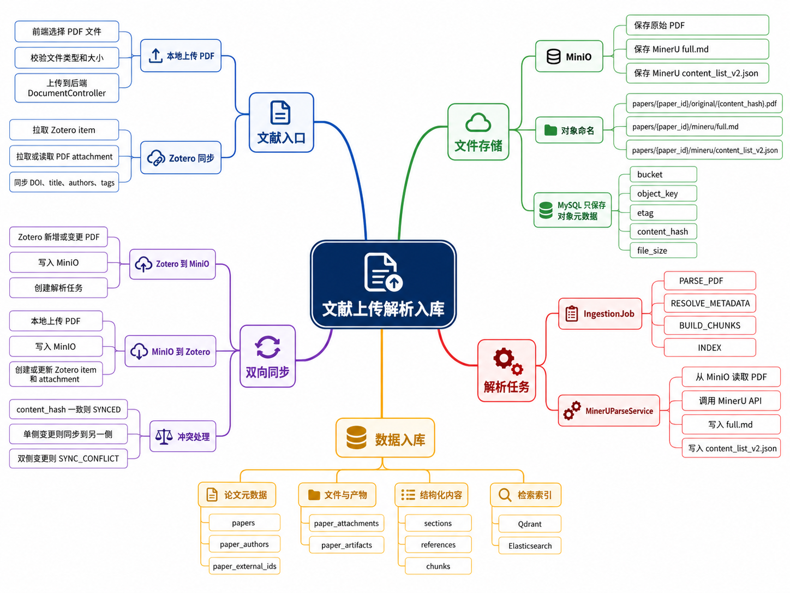
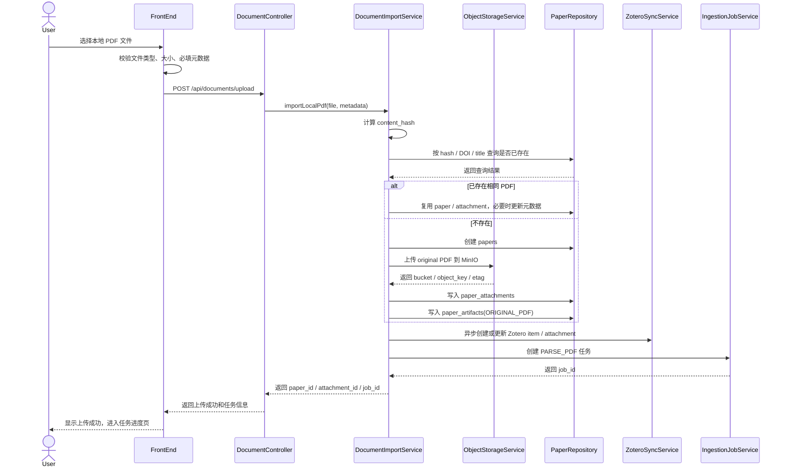
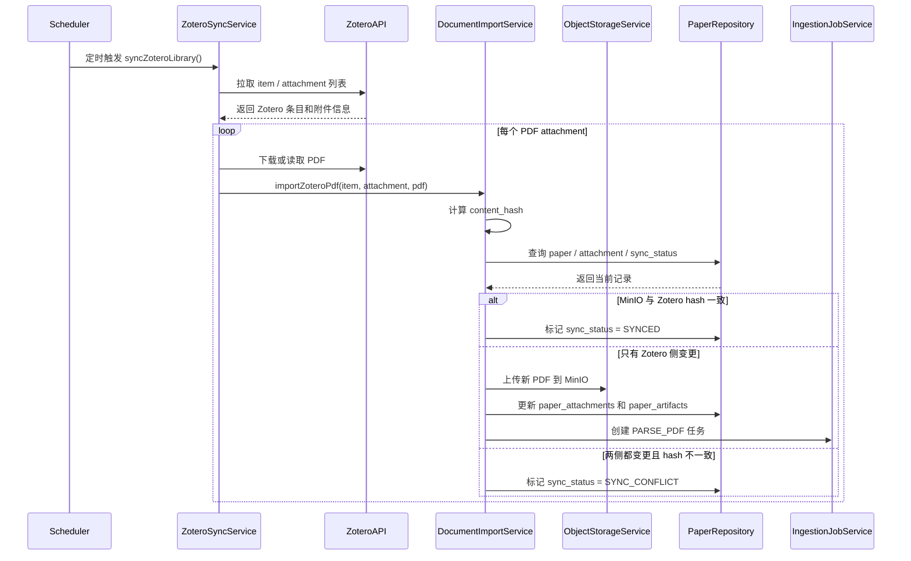
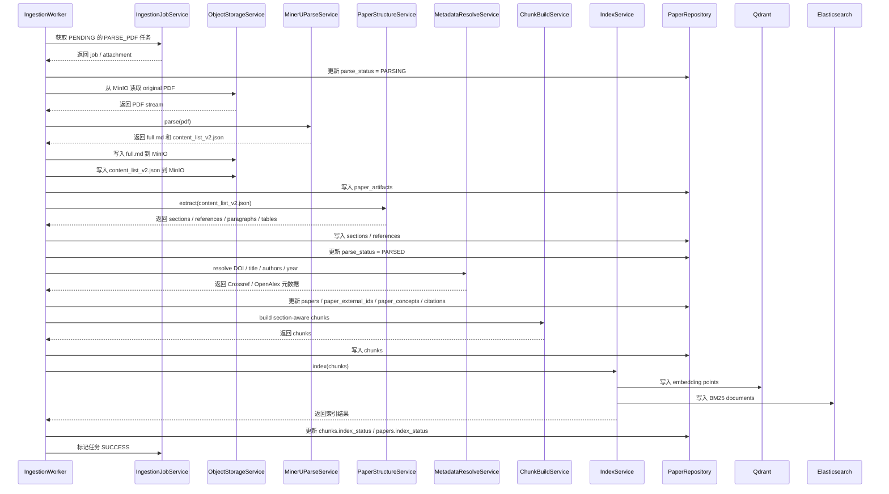

# ScholarEase 文献上传、解析和入库模块设计方案

## 1. 模块定位

本文档基于《项目整体架构与技术选型.md》和《MySQL库表设计.md》，细化 ScholarEase 的文献上传、MinerU 解析和数据入库模块。

本模块负责把两类文献来源统一接入系统：

- Zotero 同步来的 PDF。
- 用户本地上传的 PDF。

进入系统后，原始 PDF 统一写入 MinIO，MySQL 只保存论文元数据、MinIO 对象地址、hash、同步状态、解析状态和入库状态。MinerU 解析产物中的 `full.md` 与 `content_list_v2.json` 也统一写入 MinIO，并在 `paper_artifacts` 表中登记。

当前 MVP 不引入登录、RBAC 和复杂权限。前端用户视为本地个人用户；文档中的 `User` 仅表示操作者。

## 2. 模块思维导图

| 文件 | MinIO object key |
|---|---|
| 原始 PDF | `papers/{paper_id}/original/{content_hash}.pdf` |
| MinerU `full.md` | `papers/{paper_id}/mineru/full.md` |
| MinerU `content_list_v2.json` | `papers/{paper_id}/mineru/content_list_v2.json` |

## 3. 后端模块划分

| 模块 | 主要职责 |
|---|---|
| `DocumentController` | 提供本地 PDF 上传、任务查询、重试解析、冲突处理等 HTTP 接口 |
| `DocumentImportService` | 统一处理本地上传和 Zotero 同步入口，负责 hash、去重、创建 paper / attachment / job |
| `ObjectStorageService` | 封装 MinIO 上传、下载、对象 key 生成、etag 读取和 hash 校验 |
| `ZoteroSyncService` | 拉取 Zotero item / attachment，处理 Zotero 到 MinIO 与本地上传到 Zotero 的双向同步 |
| `IngestionJobService` | 创建、调度、重试和更新 `ingestion_jobs` / `ingestion_job_steps` |
| `MinerUParseService` | 从 MinIO 获取 PDF，调用 MinerU API，将 `full.md` 和 `content_list_v2.json` 写回 MinIO |
| `PaperStructureService` | 从 `content_list_v2.json` 抽取章节、段落、表格、参考文献和页码 |
| `MetadataResolveService` | 调用 Crossref / OpenAlex 补全 DOI、出版源、引用数、开放链接等元数据 |
| `ChunkBuildService` | 基于章节和段落生成 section-aware chunk |
| `IndexService` | 写入 Qdrant 向量索引和 Elasticsearch BM25 索引 |

## 4. 核心数据对象

### 4.1 文件对象类型

| artifact_type | 来源 | MinIO 对象 |
|---|---|---|
| `ORIGINAL_PDF` | 本地上传或 Zotero 同步 | 原始 PDF |
| `MINERU_FULL_MD` | MinerU 解析 | `full.md` |
| `MINERU_CONTENT_LIST_V2_JSON` | MinerU 解析 | `content_list_v2.json`，也可在界面简称 `v2.json` |

### 4.2 状态字段

| 字段 | 状态值 | 说明 |
|---|---|---|
| `paper_attachments.sync_status` | `PENDING` / `SYNCING` / `SYNCED` / `SYNC_CONFLICT` / `FAILED` | Zotero 与 MinIO 的同步状态 |
| `paper_attachments.parse_status` | `PENDING` / `PARSING` / `PARSED` / `FAILED` / `SKIPPED` | PDF 解析状态 |
| `papers.metadata_status` | `PENDING` / `RESOLVING` / `RESOLVED` / `PARTIAL` / `FAILED` | 学术元数据补全状态 |
| `papers.index_status` | `PENDING` / `EMBEDDING` / `INDEXING` / `INDEXED` / `PARTIAL` / `FAILED` | 检索索引状态 |
| `ingestion_jobs.status` | `PENDING` / `RUNNING` / `SUCCESS` / `FAILED` / `CANCELED` / `RETRYING` | 导入任务状态 |

## 5. 本地上传 PDF 时序

## 6. Zotero 同步 PDF 时序

## 7. 解析和入库时序

## 8. 入库规则

| 阶段 | 写入对象 | 关键字段 |
|---|---|---|
| 创建论文 | `papers` | `title`、`doi`、`zotero_item_key`、`pdf_attachment_key`、`pdf_content_hash` |
| 保存 PDF | `paper_attachments` | `storage_bucket`、`storage_object_key`、`content_hash`、`sync_status`、`parse_status` |
| 登记文件产物 | `paper_artifacts` | `artifact_type`、`storage_bucket`、`storage_object_key`、`content_hash` |
| 解析章节 | `sections` | `section_title`、`section_type`、`section_path`、`page_start`、`page_end` |
| 解析参考文献 | `references` | `raw_text`、`reference_order`、`doi`、`match_status` |
| 构建 chunk | `chunks` | `chunk_text`、`context_text`、`section_path`、`page_start`、`content_hash` |
| 写入向量索引 | Qdrant | `chunk_id`、`paper_id`、`section_path`、`page_start`、向量 |
| 写入关键词索引 | Elasticsearch | `chunk_id`、`title`、`authors`、`chunk_text`、`keywords` |

## 9. 去重和冲突规则

### 9.1 去重优先级

1. PDF `content_hash` 完全一致：认为是同一文件，复用已有附件。
2. DOI 完全一致：认为是同一论文，但需要检查 PDF 是否为新版本。
3. 标题、第一作者、年份高度一致：标记为疑似重复，允许用户确认。

### 9.2 Zotero 与 MinIO 冲突

| 场景 | 处理 |
|---|---|
| Zotero hash 与 MinIO hash 一致 | 标记 `SYNCED` |
| 只有 Zotero 侧变更 | 覆盖 MinIO 中的主 PDF 对象，创建重解析任务 |
| 只有 MinIO 侧变更 | 上传或更新 Zotero attachment |
| 两侧都变更且 hash 不一致 | 标记 `SYNC_CONFLICT`，等待用户选择保留 Zotero 版本或 MinIO 版本 |

冲突解决后必须重新计算 `content_hash`，并按需创建 `PARSE_PDF`、`BUILD_CHUNKS`、`INDEX` 任务。

## 10. 失败处理和重试

| 失败点 | 状态变化 | 处理方式 |
|---|---|---|
| PDF 上传 MinIO 失败 | `sync_status = FAILED` | 前端提示重试；后端保留错误信息 |
| Zotero 同步失败 | `sync_status = FAILED` | 不影响 MinIO 内部解析，可稍后补同步 |
| MinerU API 失败 | `parse_status = FAILED`，job `FAILED` | 保留原始 PDF，允许手动重试 |
| `content_list_v2.json` 结构异常 | `parse_status = FAILED` | 保存 MinerU 原始产物，记录异常字段 |
| Crossref / OpenAlex 失败 | `metadata_status = FAILED` 或 `PARTIAL` | 不阻塞 chunk 和索引，可后续补跑 |
| Qdrant / Elasticsearch 写入失败 | `index_status = FAILED` 或 `PARTIAL` | 支持单独重建索引 |

## 11. 前端页面建议

| 页面 | 功能 |
|---|---|
| 文献上传页 | 本地选择 PDF、填写可选 DOI / 标题、显示上传进度 |
| 文献任务页 | 展示上传、Zotero 同步、MinerU 解析、元数据补全、索引写入进度 |
| 文献详情页 | 展示 PDF 来源、MinIO 产物、章节、chunk、解析状态 |
| 同步冲突页 | 展示 Zotero 版本和 MinIO 版本的 hash、文件名、更新时间，允许选择保留版本 |
| 解析结果页 | 展示 `full.md`、`content_list_v2.json` 摘要、章节树和参考文献列表 |

## 12. API 草案

| 接口 | 方法 | 说明 |
|---|---|---|
| `/api/documents/upload` | `POST` | 本地上传 PDF，创建 paper / attachment / ingestion job |
| `/api/documents/{paperId}` | `GET` | 查询论文详情、附件、产物和处理状态 |
| `/api/documents/{paperId}/artifacts` | `GET` | 查询 PDF、`full.md`、`content_list_v2.json` 对象信息 |
| `/api/ingestion/jobs/{jobId}` | `GET` | 查询导入任务进度 |
| `/api/ingestion/jobs/{jobId}/retry` | `POST` | 重试失败任务 |
| `/api/zotero/sync` | `POST` | 手动触发 Zotero 同步 |
| `/api/zotero/conflicts` | `GET` | 查询 Zotero / MinIO 同步冲突 |
| `/api/zotero/conflicts/{attachmentId}/resolve` | `POST` | 选择保留 Zotero 版本或 MinIO 版本 |

## 13. MVP 落地顺序

1. 增加 MinIO Docker Compose、后端 MinIO 配置和 `ObjectStorageService`。
2. 实现本地 PDF 上传接口，完成 PDF 写入 MinIO、`papers`、`paper_attachments`、`paper_artifacts`。
3. 实现 `ingestion_jobs` 和 `ingestion_job_steps` 的创建与查询。
4. 接入 MinerU API，将 `full.md` 和 `content_list_v2.json` 写入 MinIO。
5. 从 `content_list_v2.json` 抽取 `sections`、`references` 和基础 `chunks`。
6. 接入 Crossref / OpenAlex 元数据补全。
7. 接入 Qdrant 和 Elasticsearch 索引写入。
8. 实现 Zotero 同步到 MinIO。
9. 实现本地上传后同步回 Zotero。
10. 实现 `SYNC_CONFLICT` 查询和手动解决。
