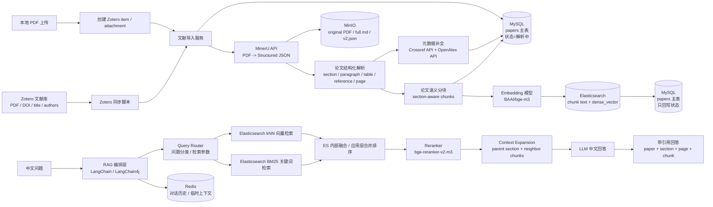

# ScholarEase 项目整体架构与技术选型

## 1. 项目定位

ScholarEase 面向英文研究论文文献库，支持用户用中文提问，并用中文生成带引用来源的回答。系统目标不是简单把 PDF 切块后写入向量库，而是构建一个可追溯、可评估、可扩展的论文 RAG 系统。

核心能力包括：

- 支持从 Zotero 文献库同步论文 PDF 和文献元数据；当前 MVP 的本地上传入口先写入 Zotero，Zotero 写入失败则直接抛出错误且不写 MySQL。
- 使用 MinIO 容器保存原始 PDF 和 MinerU 解析产物，MySQL 只保存对象地址、hash、同步状态和业务元数据。
- 使用 MinerU API 解析 PDF，提取标题、摘要、章节、正文、页码、表格、参考文献等结构化 JSON 信息。
- 使用 Crossref API + OpenAlex API 补全文献元数据，包括 DOI、期刊、出版社、卷期页、引用数、开放获取链接和学科概念。
- 按论文结构进行 section-aware chunk，而不是固定长度粗暴切分。
- 使用 Elasticsearch 同时保存 chunk 文本和 dense_vector 向量，统一承担 BM25 关键词检索和向量语义检索。
- 后续如果向量规模变大或需要更专业的向量索引能力，再将向量索引拆分到 Qdrant。
- 使用 Redis 保存多轮对话历史。
- 尽可能使用 LangChain / LangChain4j 组织 RAG 流程。
- 最终回答必须带 paper、section、page、chunk 等引用来源。

设计原则：

- 英文论文检索要兼顾语义相似和关键词精确匹配。
- 中文问题检索英文文献时，embedding 模型必须支持中英跨语言语义对齐。
- 文献 PDF 上传流程当前以 Zotero 作为第一落点；MinerU 解析完成后，再将原始文件和 MinerU 产物写入 MinIO。
- MySQL 不直接保存大文件，只保存 PDF、MinerU `full.md`、MinerU `content_list_v2.json` 等对象的 bucket、object key、hash、大小和同步状态。
- MVP 阶段暂时只操作 `papers` 主表：Zotero 写入成功后写入论文元数据，并将状态置为解析中；MinerU 解析、MinIO 保存、向量化和 Elasticsearch 写入完成后，只回写状态字段。
- 优先使用在线解析和免费学术元数据 API，降低本地 Docker / WSL2 内存压力。
- 当前版本不做登录和安全校验，先聚焦个人/本地科研助手场景。
- MVP 先完成高质量论文问答，再扩展图谱、综述、claim-evidence 等高级能力。

## 2. 总体架构



## 3. 技术选型总览

| 模块 | 技术选型 | 说明 |
|---|---|---|
| 前端 | Vue 3 + TypeScript + Vite | 构建论文库、问答页、检索结果和引用跳转界面 |
| UI 组件 | Element Plus | 与 Vue 3 集成简单，适合管理型界面 |
| 后端 | Java 17 + Spring Boot 3 | 负责业务 API、任务编排、检索接口和问答接口 |
| RAG 编排 | LangChain4j 优先，必要时补充 Python LangChain 服务 | 尽量复用 LangChain 生态的 retriever、reranker、prompt、memory 编排 |
| 文献来源 | Zotero 文献库 + 本地上传 | Zotero 同步和本地 PDF 上传都可以进入导入流程 |
| 对象存储 | MinIO | 保存原始 PDF、MinerU `full.md`、MinerU `content_list_v2.json` 等文件对象 |
| Zotero 同步 | Zotero Web API / 本地脚本 | 同步 item、attachment、DOI、title、authors、PDF 附件和 MinIO 对象映射 |
| 元数据存储 | MySQL 8 | 保存论文元数据、章节、chunk、引用、任务状态和检索日志 |
| 对话历史 | Redis | 保存 session 级多轮问答历史和临时上下文 |
| PDF 解析 | MinerU API | 当前阶段用于论文 PDF 结构化解析，输出章节、段落、表格、页码和参考文献 JSON |
| 元数据补全 | Crossref API + OpenAlex API | Crossref 优先补 DOI、期刊、出版社、卷期页；OpenAlex 补引用数、开放获取链接、概念和引用关系 |
| 检索与索引 | Elasticsearch | 同时保存 chunk text 和 dense_vector，支持 BM25 关键词检索和 kNN 向量检索 |
| 向量数据库 | 暂不单独引入 Qdrant | 当前 MVP 先简化部署；后续数据量或向量检索压力增大时再拆分 |
| Embedding 模型 | BAAI/bge-m3 | 中英跨语言检索、长文本、多语言论文 RAG 的默认模型 |
| Rerank 模型 | BAAI/bge-reranker-v2-m3 | 对 Elasticsearch BM25 + kNN 融合结果进行精排，提高证据准确率 |
| 回答模型 | DeepSeek / Qwen / OpenAI / Anthropic 等可切换 | 用于中文回答、摘要、引用整合 |
| 部署 | Docker Compose | 本地开发和个人使用优先 |

## 4. 分层设计

### 4.1 前端层

前端使用 Vue 3，主要服务个人科研助手使用场景，不设计登录页和复杂权限系统。

主要页面：

- 文献库页面：展示从 Zotero 同步来的论文列表、作者、年份、标签、解析状态。
- 论文详情页：展示摘要、章节、PDF 来源、chunk 解析结果和引用信息。
- 问答页面：支持中文提问、多轮对话、引用来源展开。
- 检索调试页：展示 Elasticsearch BM25、Elasticsearch kNN、rerank 三个阶段的结果，方便优化 RAG。
- 任务页面：展示 Zotero 同步、MinerU 解析、Crossref/OpenAlex 补全、embedding、索引写入进度。

推荐技术：

- Vue 3。
- TypeScript。
- Vite。
- Element Plus。
- Pinia。
- Vue Router。
- Axios。

### 4.2 Java 后端层

后端使用 Java 17 + Spring Boot 3，当前版本不需要 Spring Security、JWT、登录注册和权限控制。

核心模块：

- ZoteroSyncService：同步 Zotero 条目、附件、PDF 文件和元数据，并维护与 MinIO 对象的映射。
- DocumentImportService：统一处理 Zotero 同步和本地上传两类入口，负责去重、写入 `papers` 主表并创建解析任务。
- ObjectStorageService：封装 MinIO 上传、下载、对象 key 生成、hash 校验和对象元数据读取。
- PaperService：管理论文元数据、解析状态、去重和版本。
- IngestionService：编排 PDF 解析、元数据补全、分块、embedding、索引写入任务。
- MetadataResolveService：根据 DOI、标题、作者、年份调用 Crossref 和 OpenAlex，补全文献出版信息与引用关系。
- RetrievalService：调用 Elasticsearch，完成 BM25 关键词检索、kNN 向量检索和结果融合。
- RerankService：调用 reranker 模型，对召回 chunk 精排。
- AnswerService：组织上下文、提示词和引用格式，调用 LLM 生成中文回答。
- ConversationService：读写 Redis 中的对话历史。
- EvaluationService：记录检索日志、人工测试集、引用正确性和失败案例。

推荐技术：

- Java 17。
- Spring Boot 3。
- MyBatis Plus。
- Spring Web。
- Spring Scheduler 或轻量任务队列。
- SpringDoc OpenAPI。
- RedisTemplate / Redisson。
- Elasticsearch Java API Client。

### 4.3 LangChain / LangChain4j 编排层

系统尽可能使用 LangChain 思路组织 RAG，但要把论文解析、chunk 设计、元数据结构这些核心逻辑掌握在项目内部。

推荐落地方式：

- 如果希望主要逻辑都在 Java：优先使用 LangChain4j。
- 如果部分模型和检索组件 Java 生态不成熟：增加一个 Python RAG Service，使用 LangChain Python，通过 HTTP 被 Java 后端调用。
- MVP 可以先用 Java 自己编排 retrieval + rerank + prompt，接口设计保持 LangChain 化，后续逐步替换为 LangChain4j 组件。

LangChain 负责：

- Retriever 抽象。
- Elasticsearch BM25 检索器。
- Elasticsearch dense_vector / kNN 检索器。
- BM25 + kNN 结果合并 / compression retriever。
- reranker 接入。
- prompt template。
- conversation memory。
- answer chain。

项目内部负责：

- Zotero 同步。
- MinerU API 解析。
- Crossref/OpenAlex 元数据补全。
- section-aware chunk。
- MySQL 数据模型。
- chunk_id、paper_id、section_path、page 等 provenance 字段。
- 检索日志和质量评估。

### 4.4 文档处理层

PDF 文件有两个入口：从 Zotero 同步而来，或由用户在 ScholarEase 本地上传。当前 MVP 明确采用“本地上传先进入 Zotero，Zotero 成功后写 MySQL 主表，MinerU 解析后再进入 MinIO”的顺序。Zotero 写入失败时流程直接抛出错误，不写入 MySQL。

MinIO 建议只保存文件对象，不承担业务查询职责。MVP 阶段 MySQL 暂时只操作 `papers` 主表：Zotero 写入成功后，直接写入论文基础字段、Zotero 映射字段，并把状态字段置为 `1` 表示解析中；MinerU 解析、MinIO 保存、向量化、写入 Elasticsearch 完成或失败后，只修改状态字段。`paper_attachments`、`paper_artifacts`、`sections`、`chunks` 等表留到后续迭代再拆分。

如果 `papers` 主表需要保存 MinIO bucket / object key，由于最后一次 MySQL 更新只允许修改状态字段，这些对象地址必须在第一次写 `papers` 时按规则预生成并写入；否则当前 MVP 不在主表中保存 MinIO 对象地址。

推荐对象 key：

```text
papers/{paper_id}/original/{content_hash}.pdf
papers/{paper_id}/mineru/full.md
papers/{paper_id}/mineru/content_list_v2.json
```

MVP 处理流程：

1. 用户通过前端/API 上传 PDF。
2. 后端计算 `paper_md5`，用于去重和文件标识。
3. ZoteroSyncService 先创建或更新 Zotero item，并上传 PDF attachment；如果 Zotero 写入失败，直接抛出错误，不写 `papers` 主表。
4. PaperService 写入 `papers` 主表：基础元数据、Zotero item / attachment 信息、`paper_md5` 等字段直接入库，并将状态字段置为 `1`，表示解析中。
5. IngestionService 使用上传文件或 Zotero attachment 可读文件调用 MinerU API 解析。
6. ObjectStorageService 将原始 PDF 和 MinerU 产物保存到 MinIO；暂不拆分写入 `paper_artifacts`。
7. 如果 MinIO 对象地址需要落主表，必须使用写入 `papers` 前已预生成的 bucket / object key。
8. 根据 MinerU 结果生成可向量化文本。
9. 使用 bge-m3 或当前选定 embedding 模型生成向量。
10. 将 chunk 文本、向量和必要 metadata 写入 Elasticsearch。
11. PaperService 回写 `papers` 主表状态字段：成功、失败或待重试；除状态字段外，其它字段本轮不再修改。

后续完整流程可以再恢复章节表、chunk 表、artifact 表、Crossref/OpenAlex 元数据补全和独立向量库；当前阶段先把“上传 -> Zotero -> 主表状态=解析中 -> MinerU -> MinIO 保存原始文件和 MinerU 产物 -> 向量化 -> Elasticsearch -> 主表状态”跑通。

同步冲突策略：

- MinIO 和 Zotero 两侧都没有变更时保持 `SYNCED`。
- 只有 Zotero PDF 变更时，重新拉取 PDF 到 MinIO，更新 hash，并创建重解析任务。
- 只有本地上传或 MinIO 侧 PDF 变更时，上传或更新 Zotero attachment。
- 两侧都变更且 `content_hash` 不一致时，标记 `SYNC_CONFLICT`，不自动覆盖，由任务页提示用户选择保留哪一份。

### 4.5 检索层

当前 MVP 只使用 Elasticsearch 做检索与索引。Elasticsearch 的同一个 chunk document 同时保存原文 `textContent` 和向量 `vector`，因此可以在一个系统内完成 BM25 关键词检索和 kNN 向量语义检索。

Elasticsearch 负责：

- 保存 chunk 原文，用于 BM25 关键词检索。
- 保存 dense_vector，用于中文问题到英文论文 chunk 的跨语言语义召回。
- 保存 `paperId`、`paperMd5`、`chunkIndex`、`userId`、`orgTag`、`isPublic`、`pageStart`、`sectionTitle` 等 metadata，用于权限过滤、论文过滤和引用展示。
- 支持方法名、模型名、数据集名、指标名、作者名、缩写、公式符号等精确词召回。

推荐单条 chunk 文档结构：

```json
{
  "id": "paperMd5_000001",
  "paperId": 1,
  "paperMd5": "文件MD5",
  "chunkIndex": 1,
  "textContent": "某个文档分块的文本内容",
  "vector": [0.0123, -0.0456],
  "embeddingModel": "bge-m3",
  "userId": 1,
  "orgTag": "default",
  "isPublic": false,
  "title": "论文标题",
  "pageStart": 1,
  "pageEnd": 2,
  "sectionTitle": "Introduction"
}
```

默认查询流程：

```text
中文 query
  -> bge-m3 生成 query embedding
  -> Elasticsearch kNN 向量检索 top 40
  -> Elasticsearch BM25 关键词检索 top 40
  -> ES 内部融合或应用层 RRF 合并到 top 60
  -> bge-reranker-v2-m3 精排 top 10
  -> parent section + neighbor chunk 扩展
  -> LLM 中文回答并附引用
```

推荐默认参数：

```text
knn_top_k = 40
bm25_top_k = 40
merged_top_k = 60
rerank_top_k = 10
final_context = 4-8 chunks
```

融合策略优先使用 RRF：

```text
rrf_score = 1 / (k + knn_rank) + 1 / (k + bm25_rank)
```

如果需要手动调权，可使用：

```text
final_score = dense_score * 0.6 + bm25_score * 0.4
```

## 5. 向量模型与重排模型

### 5.1 Embedding 模型

默认使用：

```text
BAAI/bge-m3
```

选择理由：

- 支持中英文和多语言检索。
- 适合“中文提问、英文文献召回”的跨语言场景。
- 支持较长输入，适合论文 chunk。
- 本地部署成本可控，适合个人科研助手。
- 可写入 Elasticsearch `dense_vector` 字段，和 BM25 文本索引放在同一个 chunk document 中。

建议配置：

```text
embedding_model = BAAI/bge-m3
vector_dimension = 1024
distance = cosine
chunk_size = 400-800 tokens
chunk_overlap = 80-150 tokens
```

可选替代：

| 模型 | 使用场景 |
|---|---|
| OpenAI text-embedding-3-large | 不想本地部署，追求稳定 API |
| voyage-4 / voyage-4-large | 追求高质量 API 检索 |
| jina-embeddings-v4 | 后续需要复杂文档、多模态或图表相关能力 |
| Cohere embed-v4.0 | 企业检索、长文档和云 API 场景 |

MVP 推荐先使用 bge-m3，不要一开始引入太多模型变量。

### 5.2 Rerank 模型

默认使用：

```text
BAAI/bge-reranker-v2-m3
```

选择理由：

- 支持多语言 query-passage 相关性判断。
- 适合中文问题和英文 chunk 的精排。
- 能显著降低“看起来相关但不能回答问题”的候选。
- 只对 top 60 中的 top 10-20 做精排，成本可控。

调用方式：

```text
input: 中文 query + 英文 chunk_text
output: relevance score
```

### 5.3 LLM 回答模型

LLM 负责根据检索到的英文证据生成中文回答，不负责凭空补充论文事实。

候选模型：

- DeepSeek。
- Qwen。
- OpenAI。
- Anthropic。
- 本地部署模型。

回答提示词必须约束：

- 只依据给定 context 回答。
- 中文回答。
- 每个关键结论附引用。
- 引用格式包含 paper title、section、page、chunk_id。
- 不确定时明确说明证据不足。

## 6. 数据存储设计

### 6.1 MySQL

MySQL 保存业务数据、文献元数据、解析结果和检索日志。

MVP 当前约束：先只落 `papers` 主表。文件导入时直接写入主表可获得的字段，并将 `parse_status` 置为 `1` 表示解析中；MinerU、向量化和 Elasticsearch 写入结束后，只更新 `parse_status`。下面的其它表是后续规范化拆表方向，不作为当前第一版强制实现。

核心表：

- papers：论文基本信息和 Zotero item 映射。
- paper_attachments：PDF 附件信息，保存 Zotero attachment 与 MinIO 原始 PDF 对象映射。
- paper_artifacts：文件产物信息，保存原始 PDF、MinerU `full.md`、MinerU `content_list_v2.json` 等对象。
- sections：章节树。
- chunks：分块文本、页码、段落、父子关系。
- references：MinerU 抽取的参考文献原文、匹配状态和 DOI。
- citations：OpenAlex 补全后的引用关系。
- paper_external_ids：Crossref、OpenAlex、DOI、arXiv 等外部标识映射。
- ingestion_jobs：同步、解析、索引任务。
- retrieval_logs：Elasticsearch BM25、Elasticsearch kNN、rerank 的召回记录。
- qa_sessions：问答会话摘要。

papers 建议字段：

```text
paper_id
zotero_item_key
zotero_library_id
title
abstract
authors
year
venue
doi
issn
publisher
volume
issue
pages
arxiv_id
openalex_id
cited_by_count
open_access_url
tags
pdf_attachment_key
pdf_storage_bucket
pdf_storage_object_key
pdf_content_hash
parse_status
metadata_status
index_status
created_at
updated_at
```

chunks 建议字段：

```text
chunk_id
paper_id
section_id
chunk_text
chunk_type
section_title
section_path
page_start
page_end
paragraph_index
previous_chunk_id
next_chunk_id
parent_section_id
token_count
content_hash
embedding_model
indexed_at
```

### 6.2 Redis

Redis 用于保存对话过程中的短期状态。

主要用途：

- 多轮对话历史。
- 当前 session 的检索上下文。
- 用户最近打开的 paper_id。
- 临时 query rewrite 结果。
- 任务进度缓存。

建议 key：

```text
chat:session:{session_id}:messages
chat:session:{session_id}:context
ingestion:job:{job_id}:progress
```

### 6.3 Elasticsearch

Elasticsearch 用于统一保存 chunk 文本、metadata 和 dense_vector 向量，当前 MVP 不单独引入 Qdrant。

推荐 index：

```text
scholarease_chunks
scholarease_papers
```

chunk document：

```text
id
paperId
paperMd5
chunkIndex
title
authors
year
venue
sectionTitle
sectionPath
pageStart
pageEnd
textContent
vector
embeddingModel
keywords
zoteroItemKey
userId
orgTag
isPublic
```

推荐 mapping 要点：

```text
textContent: text, analyzer = english
vector: dense_vector, dims = embedding 模型维度, index = true, similarity = cosine
paperMd5 / embeddingModel / orgTag / sectionTitle: keyword
paperId / userId / chunkIndex / pageStart / pageEnd: long 或 integer
isPublic: boolean
```

英文论文为主，分词器可以先用默认 English analyzer。中文 query 的语义召回通过 query embedding + Elasticsearch kNN 完成；如果 BM25 关键词召回效果不稳定，后续再增加 query translation 或英文 query rewrite。

### 6.4 Qdrant 后续扩展

Qdrant 暂不作为当前 MVP 必选组件。后续如果 Elasticsearch 的向量检索性能、索引管理或多模型向量版本管理不能满足需求，再把 `vector` 字段拆到 Qdrant，Elasticsearch 保留 `textContent` 做 BM25。

## 7. Zotero 与 MinIO 双向同步设计

Zotero 是本项目的文献管理端，MinIO 保存 ScholarEase 解析后的原始文件副本和 MinerU 产物。当前 MVP 对本地上传采用固定顺序：先写 Zotero，Zotero 失败则直接抛出错误且不写 MySQL；Zotero 成功后写 MySQL `papers` 主表并置为解析中；MinerU 解析后再写 MinIO；向量化和 Elasticsearch 写入完成后，只回写 `papers` 的状态字段。

同步内容：

- item key。
- library id。
- title。
- creators / authors。
- year。
- publication title / venue。
- DOI。
- arXiv ID。
- tags。
- PDF attachment key。
- PDF 本地路径或可下载链接。
- MinIO bucket、object key、etag、content_hash。
- Zotero 与 MinIO 的同步状态。

推荐实现：

- 写一个 Zotero 同步脚本，定期拉取 Zotero 文献条目。
- 本地上传入口先创建或更新 Zotero item / attachment；失败时直接返回错误，不写 `papers` 主表。
- Zotero 写入成功后，向 `papers` 主表写入基础字段和 Zotero 映射，并将状态置为解析中。
- MinerU 使用上传文件或 Zotero attachment 可读文件进行解析。
- MinerU 解析后，将原始 PDF 和 MinerU 产物写入 MinIO。
- 如果当前主表要保存 MinIO 对象地址，需要在第一次写 `papers` 时预生成 object key；流程末尾不再补写非状态字段。
- Elasticsearch 写入完成或失败后，只回写 `papers` 主表状态字段。
- 使用 `content_hash` 判断 PDF 是否需要重新解析、重新索引和同步到另一端。
- MVP 阶段 MySQL 只维护 `papers` 主表；Zotero item、attachment 和 MinIO 对象映射暂时也放在主表中。
- 同步冲突不自动覆盖，写入 `SYNC_CONFLICT` 状态，由用户确认后再保留 Zotero 版本或 MinIO 版本。

Zotero 到 MinIO：

```text
Zotero item
  -> ZoteroSyncService
  -> insert / update MySQL papers, parse_status = 1
  -> ingestion job
  -> MinerU parse
  -> write original PDF and MinerU outputs to MinIO
  -> vectorize
  -> write chunk text and vectors to Elasticsearch
  -> update MySQL papers status only
```

本地上传 MVP 流程：

```text
Local PDF upload
  -> DocumentImportService
  -> create or update Zotero item / attachment
  -> if Zotero failed, throw error and do not write MySQL
  -> insert / update MySQL papers, parse_status = 1
  -> ingestion job
  -> MinerU parse
  -> write original PDF and MinerU outputs to MinIO
  -> vectorize
  -> write chunk text and vectors to Elasticsearch
  -> update MySQL papers status only
```

## 8. 查询路由设计

| 用户问题类型 | 路由策略 |
|---|---|
| 这篇论文讲什么 | paper summary / abstract chunk |
| 某方法的实验设置是什么 | Elasticsearch kNN + BM25，section_type 偏 method/experiment |
| 某模型在哪些数据集上评估 | Elasticsearch 权重提高，重点匹配模型名和数据集名 |
| 某个概念是什么意思 | Elasticsearch kNN 权重提高，召回语义解释段落 |
| 几篇论文有什么区别 | 限定 paper_id 后分别检索 method/results/limitation |
| 某结论有没有证据 | result/discussion/limitation chunk 优先 |
| 这个领域主要路线有哪些 | 后期接 paper summary index / citation graph |

MVP 可以先用规则路由：

- 问题包含“数据集、指标、模型名、方法名、作者名”时，提高 Elasticsearch 权重。
- 问题包含“为什么、区别、机制、思想、贡献”时，提高 Elasticsearch kNN 权重。
- 用户指定某篇论文时，使用 paper_id metadata filter。
- 多轮对话中省略论文名时，从 Redis session context 读取当前 paper_id。

## 9. 推荐项目模块

```text
ScholarEase
  backend-api/              Java 17 + Spring Boot 3 主服务
  rag-service/              可选：Python LangChain RAG 服务
  zotero-sync/              Zotero 同步脚本
  metadata-resolver/         可选：Crossref/OpenAlex 元数据补全脚本或服务
  web/                      Vue 3 前端
  infra/                    Docker Compose、MySQL、MinIO、Elasticsearch 配置
  docs/                     架构、数据模型、评估方案
  scripts/                  本地导入、批处理、评估脚本
```

后端模块建议：

```text
backend-api
  paper
  zotero
  document
  storage
  ingestion
  metadata
  retrieval
  rerank
  answer
  conversation
  evaluation
  modelgateway
```

暂不需要：

```text
auth
security
login
permission
```

## 10. 部署架构

MVP 使用 Docker Compose：

```text
web
backend-api
mysql
minio
redis
elasticsearch
```

可选组件：

```text
rag-service
embedding-service
reranker-service
metadata-resolver
```

MinerU、Crossref、OpenAlex 当前按外部 API 接入，不放进本地 Docker Compose。这样可以减少本地内存占用，尤其避免 GROBID full 镜像长期占用 WSL2 资源。

如果 bge-m3 和 bge-reranker-v2-m3 本地部署，可增加独立模型服务；如果先使用 API 或脚本批处理，则不必一开始复杂化。Qdrant 暂不放入当前 Docker Compose，后续需要专用向量库时再增加。

## 11. 迭代路线

### 第一阶段：当前最小导入闭环

- Vue 3 文献上传界面。
- Java 17 后端 API。
- 本地 PDF 上传先写入 Zotero item / attachment。
- Zotero 写入失败时直接抛出错误，不写 MySQL。
- MySQL 第一版只操作 `papers` 主表：导入时状态置为解析中，流程结束后只回写状态字段。
- MinerU API 解析 PDF。
- MinerU 解析后，将原始 PDF 和 MinerU 产物写入 MinIO。
- 根据 MinerU 结果生成可向量化文本。
- bge-m3 embedding 或当前选定 embedding 模型。
- Elasticsearch 写入 chunk 文本和 dense_vector 向量。
- Elasticsearch 写入完成后，只更新 `papers` 主表状态。

### 第二阶段：MVP 论文问答

- Vue 3 问答界面。
- Crossref API + OpenAlex API 补全文献元数据。
- section-aware chunk。
- Elasticsearch BM25 + kNN 混合检索。
- bge-reranker-v2-m3 精排。
- Redis 保存对话历史。
- 中文回答并附引用。

### 第三阶段：检索质量优化

- 检索调试页。
- 50-100 个中文研究问题测试集。
- 记录 Elasticsearch BM25、Elasticsearch kNN、rerank 各阶段结果。
- 调整 chunk size、top_k、RRF 参数和 rerank_top_k。
- 增加 query rewrite，将中文问题改写为英文关键词辅助 Elasticsearch。

### 第四阶段：科研助手能力

- paper summary index。
- section summary index。
- citation graph。
- 图表和表格对象化。
- claim-evidence extraction。
- GraphRAG / RAPTOR-style summary tree。

## 12. 关键风险与取舍

| 风险 | 影响 | 应对 |
|---|---|---|
| 中文问题直接查英文 BM25 效果弱 | 关键词召回不足 | 使用 Elasticsearch dense_vector/kNN 做语义召回，后续加 query rewrite / 翻译 |
| 只用向量检索漏掉精确术语 | 方法名、数据集、指标检索不稳定 | 同一 Elasticsearch 索引保留 `textContent` 做 BM25 检索 |
| MinerU API 解析失败或限流 | chunk 质量下降，导入任务延迟 | 保留失败日志和原始 PDF，支持重试、断点续跑和手工修正 |
| Crossref/OpenAlex 匹配错误 | DOI、期刊或引用关系污染 | 使用 DOI 精确匹配优先；标题相似度、作者重合、年份校验通过后才写入主元数据 |
| 外部 API 网络不稳定 | 元数据补全任务失败 | 将解析和补全拆成独立任务，保存 pending 状态，允许后续补跑 |
| Zotero 写入失败 | MySQL 出现无效导入记录 | 直接抛出错误并终止流程，不写 `papers` 主表 |
| Zotero PDF 路径变化 | 解析任务找不到文件 | 导入阶段保留上传临时文件或 attachment 可读文件；MinerU 解析后将原始文件副本写入 MinIO 便于重试 |
| Zotero 与 MinIO 两侧同时变更 PDF | 可能误覆盖用户想保留的版本 | 使用 content_hash 比较并标记 `SYNC_CONFLICT`，等待用户选择保留版本 |
| rerank 延迟增加 | 问答响应变慢 | 只对 merged top 60 中的 top 10-20 精排 |
| Elasticsearch 同时承担文本和向量索引压力 | 本地资源占用增加 | MVP 先接受单组件简化；数据量变大后再评估拆出 Qdrant |
| LangChain 抽象过重 | 调试困难 | 核心数据模型和检索日志保留在项目内，LangChain 只做编排 |

## 13. 一句话方案

ScholarEase 采用 Vue 3 前端、Java 17 + Spring Boot 3 后端、MySQL 元数据存储、MinIO 保存原始 PDF 与 MinerU 产物、Redis 对话历史、Zotero 双向同步文献、MinerU API 解析论文结构、Crossref API + OpenAlex API 补全文献元数据、bge-m3 生成向量、Elasticsearch 同时保存 chunk 文本和 dense_vector 向量并承担 BM25 + kNN 检索、bge-reranker-v2-m3 做精排，并尽可能用 LangChain / LangChain4j 编排 RAG 流程。
